# AI Banking Risk Platform

[](https://opensource.org/licenses/MIT)
[](https://www.python.org/downloads/)
[](https://github.com/psf/black)

> **Production-ready AI/ML implementations for banking risk, compliance,
> and regulatory reporting**

Companion code repository for the book **"AI for Financial Risk, Compliance
and Regulatory Reporting: The Enterprise Implementation Guide"**

## What's Included

- 16 Complete Chapters — From AI transformation foundations to integrated production platform
- 27 Production AI Systems — MR-2026-035 through MR-2026-074-IP, all PRA SS1/23 registered
- 66,436+ Lines of Code — Tested, type-annotated Python 3.11+
- 13 Agentic AI Pipelines — LangGraph StateGraph per chapter (Chapters 3–4, 6–16)
- 5 Risk Domains — Credit, Market, Operational, Liquidity, Model Risk
- Compliance & Regulatory — AML/KYC, Basel III/CRR3, GDPR, DORA, EU AI Act, PRA SS1/23
- Enterprise Architecture — Microservices, MLOps/LLMOps, Data Infrastructure, MCP Servers

## Agentic AI Architecture

Chapters 3–4 and 6–16 each contain one `agentic_*.py` file: a LangGraph StateGraph
with five specialist agents plus a deterministic HITL gate. (Chapter 5 uses
`operational_mrm.py` for SS1/23 governance — not a LangGraph pipeline.)

```
START -> Agent1 -> Agent2 -> Agent3 -> Agent4 -> Agent5 -> HITL -> END
```

LLM allocation per run:

| Agents    | Model               | Notes                                      |
|-----------|---------------------|--------------------------------------------|
| Agents 1-3| gemini-3.5-flash    | High-throughput reasoning, tool selection  |
| Agent 4   | gemini-3.1-pro      | Complex multi-dimensional analysis         |
| Agent 5   | claude-sonnet-4-6   | Regulatory narrative, HITL decision        |

Per-run hard caps: TOKEN_BUDGET_PER_RUN = 50,000 | COST_BUDGET_GBP_PER_RUN = 2.50 GBP

DORA Art.28 LLM concentration: Google Gemini 68% | Anthropic 17% | OpenAI 15% (no provider > 70%)

### Agentic file index

| File                                     | Ch | Section | Focus                                           |
|------------------------------------------|----|---------|-------------------------------------------------|
| credit_agent/agentic_ai_patterns.py      |  3 | 3.9A    | ReAct loop, guardrails, supervisor-worker       |
| credit_agent/mcp_servers.py              |  3 | 3.9B    | FCA Handbook, Bloomberg, Model Inventory MCP    |
| rag_assistant/agentic_rag.py             |  4 | 4.9     | Multi-hop regulatory query agent, RAGAS eval    |
| model_governance/operational_mrm.py      |  5 | 5.8A    | SS1/23 deployment gate, drift monitor           |
| agentic_cim.py                           |  6 | 6.3A    | Credit Intelligence Monitor, PD/LGD/EAD, IRB   |
| agentic_market_risk.py                   |  7 | 7.3A    | VaR, ES, FRTB IMA, Greeks hedging               |
| agentic_op_risk.py                       |  8 | 8.3A    | AMA loss modelling, RCSA, fraud scoring         |
| agentic_liquidity_risk.py                |  9 | 9.3A    | LCR, NSFR, cash flow stress, FTP                |
| agentic_model_risk.py                    | 10 | 10.3A   | Champion/challenger, PSI drift, RAGAS           |
| agentic_regulatory_compliance.py         | 11 | 11.3A   | FCA/PRA obligations, regulatory calendar        |
| agentic_aml_kyc.py                       | 12 | 12.3A   | Transaction monitoring, SAR filing, KYC         |
| agentic_enterprise_architecture.py       | 13 | 13.3A   | API gateway, microservices, DORA resilience     |
| agentic_mlops_llmops.py                  | 14 | 14.3A   | CI/CD gates, RAGAS monitoring, prompt registry  |
| agentic_data_infrastructure.py           | 15 | 15.3A   | BCBS 239, feature store, data lineage           |
| agentic_integrated_platform.py           | 16 | 16.3A   | Platform health, capital adequacy, CET1 HITL    |

## MCP Server Catalogue (Chapter 3, Section 3.9B)

Three Anthropic MCP servers give agents structured, audited access to external data:

| Server              | Class                    | Key tools                                                  |
|---------------------|--------------------------|------------------------------------------------------------|
| FCA Handbook        | MCPFCAHandbookServer     | search_handbook, get_sourcebook_rule, get_ps_guidance      |
| Bloomberg Terminal  | MCPBloombergServer       | get_company_financials, get_credit_ratings, get_peer_comparables |
| AWB Model Inventory | MCPModelInventoryServer  | get_model_card, check_deployment_gate, get_validation_status |

All MCP calls are SHA-256 hashed and written to the AWB audit log.

## Companion Documentation

Reference material from the book's appendices is maintained in the [`docs/`](docs/) folder so it can be updated without requiring a reprint:

| File | Description |
|------|-------------|
| [docs/appendices/glossary.md](docs/appendices/glossary.md) | **Appendix A** — Glossary of 108 AI/ML, regulatory, and AWB-specific terms |
| [docs/appendices/regulatory-reference.md](docs/appendices/regulatory-reference.md) | **Appendix B** — Article-level summaries: PRA SS1/23, EU AI Act, DORA, CRR3/Basel IV, POCA, FCA Consumer Duty |
| [docs/appendices/tech-stack.md](docs/appendices/tech-stack.md) | **Appendix C** — Approved LLM models, Python library versions, AWS services, and per-chapter cost estimates |

---

## Repository Structure

```
ai-banking-risk-platform/
+-- README.md
+-- chapter-01-ai-transformation/
+-- chapter-02-genai-llms/
+-- chapter-03-ai-agents/
|   +-- credit_agent/
|       +-- agent.py                  # ReAct loop
|       +-- langgraph_agent.py        # LangGraph 4-node pipeline
|       +-- treasury_agent.py         # Parallel treasury agent
|       +-- streaming_agent.py        # Token-by-token streaming
|       +-- memory.py                 # Redis + PostgreSQL dual-store
|       +-- tools.py                  # 6-tool credit registry
|       +-- agentic_ai_patterns.py    # Section 3.9A -- guardrails, topology
|       +-- mcp_servers.py            # Section 3.9B -- FCA/Bloomberg/Registry
+-- chapter-04-rag-systems/
|   +-- rag_assistant/
|       +-- agentic_rag.py             # Section 4.9 -- multi-hop query agent
+-- chapter-05-ai-governance/
|   +-- model_governance/
|       +-- model_inventory.py
|       +-- validation_framework.py
|       +-- monitoring.py
|       +-- fairness_testing.py
|       +-- incident_management.py
|       +-- operational_mrm.py        # Section 5.8A -- SS1/23 gate + 23-model registry
+-- chapter-06-credit-risk/
|   +-- agentic_cim.py                # Section 6.3A -- Credit Intelligence Monitor
+-- chapter-07-market-risk/
|   +-- agentic_market_risk.py        # Section 7.3A
+-- chapter-08-operational-risk/
|   +-- agentic_op_risk.py            # Section 8.3A
+-- chapter-09-liquidity-risk/
|   +-- agentic_liquidity_risk.py     # Section 9.3A
+-- chapter-10-model-risk/
|   +-- agentic_model_risk.py         # Section 10.3A
+-- chapter-11-regulatory-compliance/
|   +-- agentic_regulatory_compliance.py  # Section 11.3A
|   +-- basel_reporting/ | mjrrp/ | stress_testing/ | hmrc_tax/
+-- chapter-12-aml-kyc/
|   +-- agentic_aml_kyc.py                # Section 12.3A
|   +-- aml_monitoring/ | digital_identity/ | kyc_credit/
+-- chapter-13-enterprise-architecture/
|   +-- agentic_enterprise_architecture.py  # Section 13.3A
+-- chapter-14-mlops-llmops/
|   +-- agentic_mlops_llmops.py       # Section 14.3A
+-- chapter-15-data-infrastructure/
|   +-- agentic_data_infrastructure.py  # Section 15.3A
+-- chapter-16-integrated-platform/
    +-- agentic_integrated_platform.py  # Section 16.3A -- capstone
```

## AWB Model Registry (27 Production Systems)

| MR Reference    | System                                      | Ch | SS1/23 Risk | EU AI Act    |
|-----------------|---------------------------------------------|----|-------------|--------------|
| MR-2026-035     | Credit Document Analyser                    |  2 | MEDIUM      | HIGH-RISK    |
| MR-2026-036     | SME Financial Statement Analyser            |  2 | MEDIUM      | HIGH-RISK    |
| MR-2026-037     | Credit Decision Agent                       |  3 | HIGH        | HIGH-RISK    |
| MR-2026-038     | Treasury Operations Agent                   |  3 | HIGH        | HIGH-RISK    |
| MR-2026-039     | Regulatory Knowledge Assistant              |  4 | LOW         | Limited      |
| MR-2026-040     | AI Governance Platform                      |  5 | LOW         | Not in scope |
| MR-2026-041     | Payment Fraud Detector                      |  8 | MEDIUM      | HIGH-RISK    |
| MR-2026-042     | Op Loss Event NLP                           |  8 | LOW         | Limited      |
| MR-2026-043     | Credit App Fraud Scorer                     |  8 | MEDIUM      | HIGH-RISK    |
| MR-2026-044     | Cash Flow Forecaster                        |  9 | MEDIUM      | Limited      |
| MR-2026-045     | LCR Stress Tester                           |  9 | HIGH        | HIGH-RISK    |
| MR-2026-046     | Credit PD Model (XGBoost)                   |  6 | HIGH        | HIGH-RISK    |
| MR-2026-047     | Market VaR Engine                           |  7 | HIGH        | HIGH-RISK    |
| MR-2026-048     | FRTB IMA Calculator                         |  7 | HIGH        | HIGH-RISK    |
| MR-2026-049     | Basel Credit Risk Reporting (COREP)         | 11 | HIGH        | Limited      |
| MR-2026-051     | Regulatory Horizon Scanner                  | 11 | LOW         | Limited      |
| MR-2026-052     | ICAAP Stress Model                          | 13 | HIGH        | HIGH-RISK    |
| MR-2026-053     | Customer Churn Predictor                    | 14 | LOW         | Limited      |
| MR-2026-054     | Feature Store PIT Engine                    | 15 | MEDIUM      | Limited      |
| MR-2026-055     | BCBS 239 Quality Monitor                    | 15 | LOW         | Not in scope |
| MR-2026-058     | Prompt Registry                             | 14 | LOW         | Not in scope |
| MR-2026-059-REG | Regulatory Compliance Monitor (Agentic)     | 11 | LOW         | Not in scope |
| MR-2026-061     | AML Transaction Monitoring System           | 12 | HIGH        | HIGH-RISK    |
| MR-2026-062     | Digital Identity Verification Platform     | 12 | HIGH        | HIGH-RISK    |
| MR-2026-063     | KYC Credit Borrower Screening               | 12 | HIGH        | HIGH-RISK    |
| MR-2026-064     | AML Typologies RAG                          | 12 | LOW         | Limited      |
| MR-2026-074-IP  | Integrated Platform Agent                   | 16 | HIGH        | HIGH-RISK    |

## Quick Start

```bash
# Clone
git clone https://github.com/lorvexai/ai-banking-risk-platform
cd ai-banking-risk-platform

# Create virtual environment
python3 -m venv .venv
source .venv/bin/activate        # Windows: .venv\Scripts\activate

# Install dependencies
pip install -r requirements.txt

# Run all tests (no live API calls required)
pytest chapter-*/*/tests/ chapter-*/tests/ -v -k "not live"

# Run Chapter 16 capstone agentic pipeline
cd chapter-16-integrated-platform
python -c "
import asyncio
from agentic_integrated_platform import run_agentic_integrated_platform
asyncio.run(run_agentic_integrated_platform())
"
```

## Regulatory Framework

| Standard          | Scope in this codebase                                          |
|-------------------|-----------------------------------------------------------------|
| PRA SS1/23        | Primary model risk standard -- 4-gate deployment, 23-model registry |
| EU AI Act         | High-risk classification, human oversight (Art.14)              |
| DORA Art.28       | LLM concentration cap -- no single provider > 70%              |
| DORA Art.11       | RTO <= 120 min (P1), PRA notification <= 4 hours               |
| CRR3 Art.72e      | Output floor >= 55% (Gate 4 in SS1/23 deployment gate)         |
| FCA PS22/9        | Consumer Duty -- fairness parity +-5pp in champion/challenger  |
| BCBS 239          | Data quality P1-P11 (target >= 9.2/10)                         |
| UK GDPR Art.5     | Data minimisation -- PSI uses histograms not raw records        |
| FCA COBS 9        | 7-year audit log retention                                      |
| POCA 2002 s.333A  | SAR history -- MLRO access only                                |

## Parent-Level Chapter Map

```mermaid
flowchart TD
    ROOT["AI Banking Risk Platform\n66,436+ lines | 27 production systems"] --> C01["Chapters 01-05\nFoundations and Core AI"]
    ROOT --> C06["Chapters 06-10\nRisk Domains"]
    ROOT --> C11["Chapters 11-12\nRegulatory and AML/KYC"]
    ROOT --> C13["Chapters 13-16\nArchitecture to Integrated Platform"]

    C01 --> C1["01 AI Transformation\nchatbot, NLP pipeline"]
    C01 --> C2["02 GenAI and LLMs\ndocument analyser"]
    C01 --> C3["03 AI Agents\nReAct + LangGraph + MCP (3.9A/B)"]
    C01 --> C4["04 RAG Systems\ncontextual retrieval + agentic RAG"]
    C01 --> C5["05 AI Governance\nSS1/23 gate + 23-model registry (5.8A)"]

    C06 --> C6["06 Credit Risk\nPD/LGD/EAD, IFRS 9 (6.3A)"]
    C06 --> C7["07 Market Risk\nVaR, ES, FRTB (7.3A)"]
    C06 --> C8["08 Operational Risk\nAMA, RCSA, fraud (8.3A)"]
    C06 --> C9["09 Liquidity Risk\nLCR, NSFR, FTP (9.3A)"]
    C06 --> C10["10 Model Risk\nchampion/challenger, PSI (10.3A)"]

    C11 --> C11a["11 Regulatory Compliance\nhorizon scanning (11.3A)"]
    C11 --> C12["12 AML and KYC\ntransaction monitoring (12.3A)"]

    C13 --> C13a["13 Enterprise Architecture\nAPI gateway, DORA (13.3A)"]
    C13 --> C14["14 MLOps and LLMOps\nCI/CD, RAGAS, prompts (14.3A)"]
    C13 --> C15["15 Data Infrastructure\nBCBS 239, feature store (15.3A)"]
    C13 --> C16["16 Integrated Platform\nCET1 HITL, capstone (16.3A)"]
```



---

Avon and Wessex Bank plc (AWB) is entirely fictional.
Nothing in this repository constitutes regulatory or legal advice.

Book: "AI for Financial Risk, Compliance and Regulatory Reporting: The Enterprise Implementation Guide"
Author: Sree Kotha
