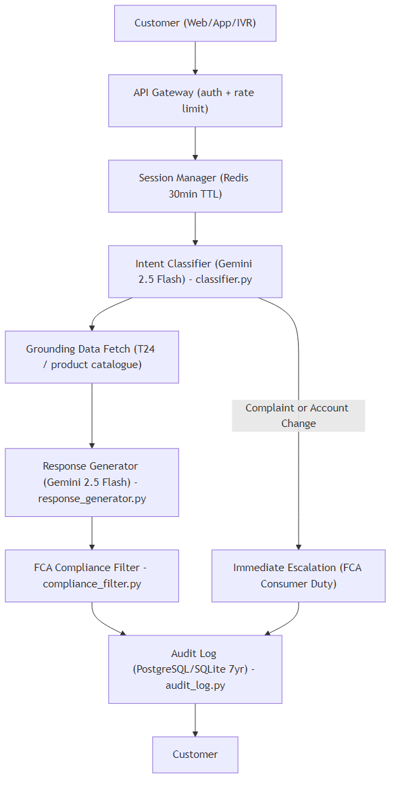
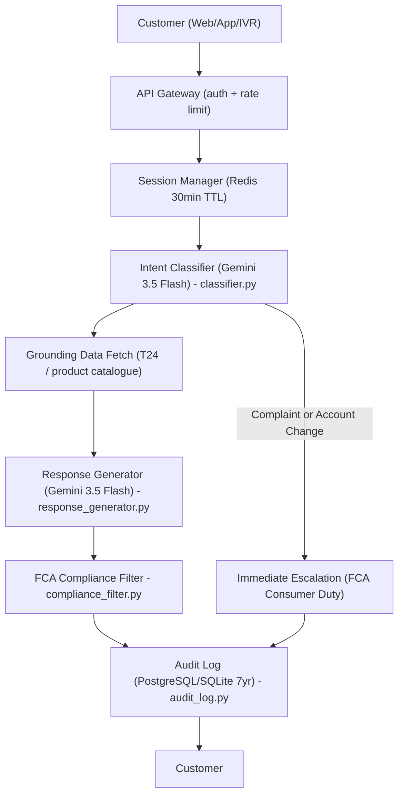
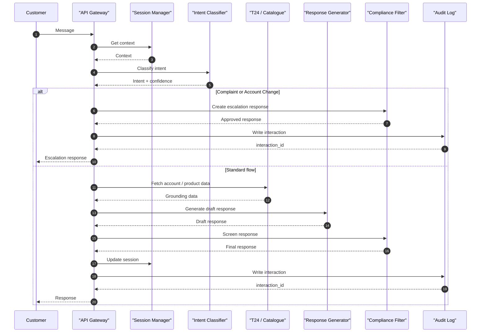
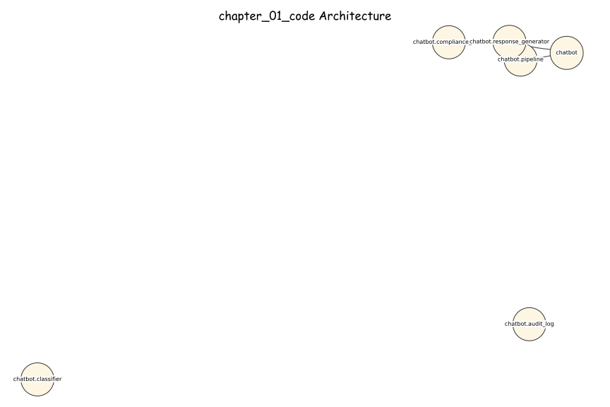
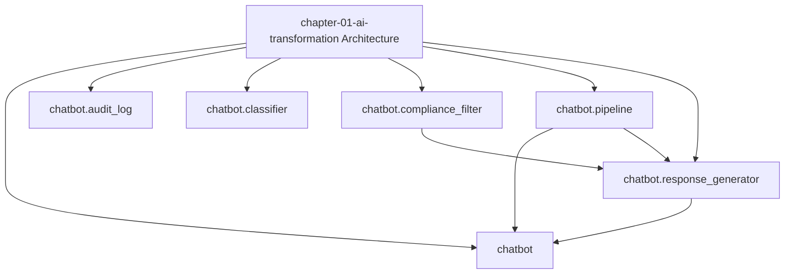

# AI Banking Risk Platform

[](https://opensource.org/licenses/MIT)
[](https://www.python.org/downloads/)
[](https://github.com/psf/black)

> **Production-ready AI/ML implementations for banking risk, compliance, 
> and regulatory reporting**

Companion code repository for the book **"AI for Financial Risk, Compliance 
and Regulatory Reporting: The Enterprise Implementation Guide"**

## 🎯 What's Included

- ✅ **16 Complete Chapters** - From foundations to production deployment
- ✅ **50+ Production Systems** - Real, deployable implementations
- ✅ **40,000+ Lines of Code** - Tested Python code
- ✅ **5 Risk Domains** - Credit, Market, Operational, Liquidity, Model Risk
- ✅ **Compliance & Regulatory** - AML/KYC, Basel III, GDPR
- ✅ **Enterprise Architecture** - Microservices, MLOps, Data Infrastructure

## Chapter 1 - AWB AI Customer Service Platform

**AI for Financial Risk, Compliance and Regulatory Reporting**
*Avon & Wessex Bank plc (AWB) - AWB-AI-2025 Programme*

---

### Overview

This codebase implements the AWB AI Customer Service Platform described in Chapter 1
of *AI for Financial Risk, Compliance and Regulatory Reporting: The Enterprise
Implementation Guide*.

The platform automates responses to the 60% of customer interactions that are
routine - balance enquiries, product eligibility questions, rate comparisons, and FAQs -
freeing contact centre agents for complex queries, complaints, and cross-selling.

**Annual saving:** GBP 10.75M  
**Payback period:** < 10 days  
**Monthly running cost:** GBP 52 (GBP 10 LLM + GBP 42 infrastructure)

---

### Architecture





---

### Sequence Diagram



---

### Regulatory Compliance

| Obligation | Implementation |
|------------|----------------|
| FCA Consumer Duty PS22/3 | Compliance filter on every response; human escalation always available |
| PRA SS1/23 | NOT a registered model (no credit/risk decision influence) |
| DORA | ICT Asset CS-2026-001; multi-LLM fallback configurable |
| UK GDPR | Account numbers masked (last 4 digits only); 7-year audit retention |

---

### Quick Start

```bash
# 1. Install dependencies
pip install -r requirements.txt

# 2. Set Google AI Studio API key
export GOOGLE_API_KEY="your_key_here"
# Get free key at: https://aistudio.google.com/app/apikey

# 3. Run tests (no API key required for unit tests)
pytest tests/ -v -k "not live"

# 4. Run all tests including live API
GOOGLE_API_KEY=your_key pytest tests/ -v

# 5. Interactive pipeline demo
python -c "
from chatbot.pipeline import process_customer_message
import uuid
result = process_customer_message(
    session_id=str(uuid.uuid4()),
    message='What is my current account balance?',
    customer_id='CUST-12345',
)
print(f'Intent: {result.intent} ({result.confidence:.0%})')
print(f'Response: {result.response_text}')
print(f'Audit ID: {result.interaction_id}')
"
```

---

### File Structure

```
chapter-01-ai-transformation/
|-- chatbot/
|   |-- __init__.py
|   |-- classifier.py          # Intent classification - Gemini 3.5 Flash
|   |-- response_generator.py  # Response generation - Gemini 3.5 Flash
|   |-- compliance_filter.py   # FCA Consumer Duty rules engine
|   |-- audit_log.py           # 7-year audit log (PostgreSQL/SQLite)
|   |-- pipeline.py            # Main orchestrator
|-- tests/
|   |-- test_chatbot.py        # 35+ tests across 8 test classes
|-- data/
|   |-- generate_sample_data.py
|-- requirements.txt
|-- README.md
```

---

### Cost Derivation (GBP)

| Component | Monthly Cost |
|-----------|-------------|
| Gemini 3.5 Flash (40M tokens x GBP 0.00025/1K) | GBP 10 |
| AWS ECS (2 tasks x t3.small) | GBP 22 |
| Redis ElastiCache (cache.t3.micro) | GBP 12 |
| PostgreSQL RDS (db.t3.micro) | GBP 6 |
| API Gateway (30K calls x GBP 0.0001) | GBP 2 |
| **Total** | **GBP 52/month** |

Annual saving: 60% deflection x 50,000 calls/month x GBP 18/call - GBP 624 opex = **GBP 10.75M/year**

*Salary basis: GBP 28,000 x 140% overhead / 1,750 hours x 7-min handle time = GBP 18/call*

---

### LLM Selection Rationale

**Gemini 3.5 Flash** selected for this use case because:
- Lowest latency (p95 < 800ms for classification)
- Lowest cost (GBP 0.25/1M tokens input)
- Sufficient capability for intent classification
- Native structured output (JSON schema enforcement)
- Free tier available for development (no credit card)

*Models from approved June 2026 list only.
Never use: GPT-4, Claude 3.5 Sonnet, Gemini 3 (deprecated).*

### Architecture Diagrams

#### Excalidraw-Style (Hand-Drawn)



#### Mermaid




