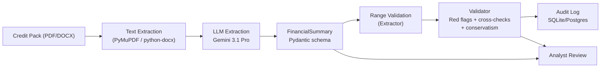
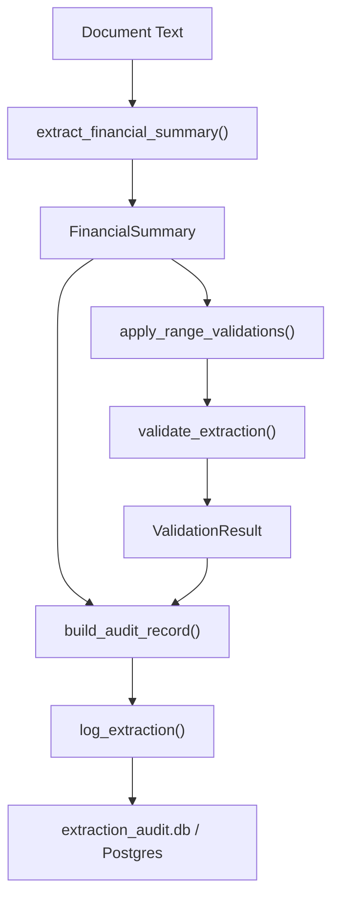
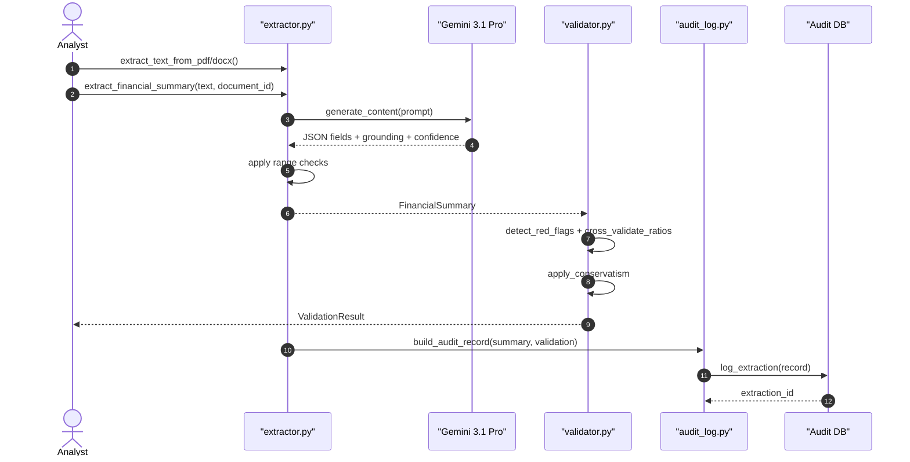
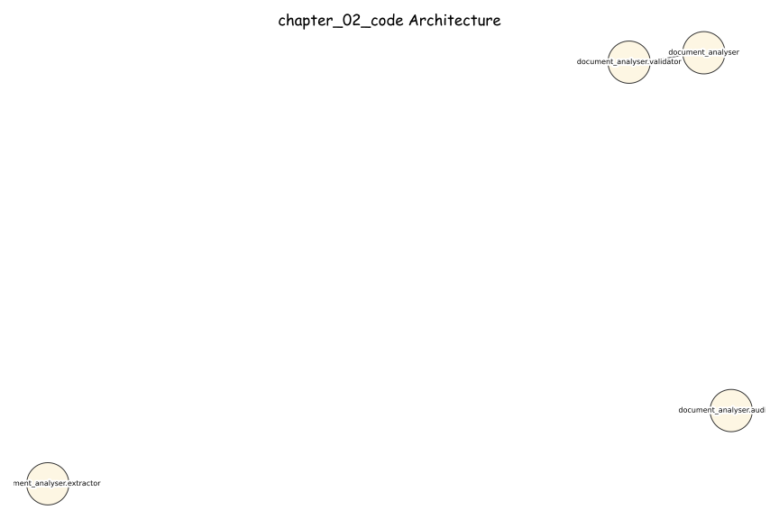
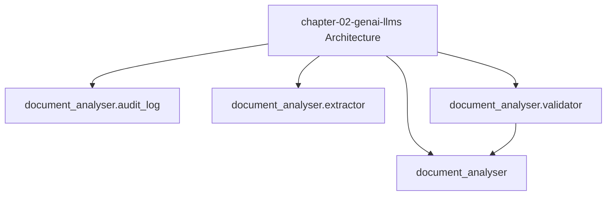

# AI Banking Risk Platform

[](https://opensource.org/licenses/MIT)
[](https://www.python.org/downloads/)
[](https://github.com/psf/black)

> **Production-ready AI/ML implementations for banking risk, compliance, 
> and regulatory reporting**

Companion code repository for the book **"AI for Financial Risk, Compliance 
and Regulatory Reporting: The Enterprise Implementation Guide"**

## 🎯 What's Included

- ✅ **16 Complete Chapters** - From foundations to production deployment
- ✅ **50+ Production Systems** - Real, deployable implementations
- ✅ **40,000+ Lines of Code** - Tested Python code
- ✅ **5 Risk Domains** - Credit, Market, Operational, Liquidity, Model Risk
- ✅ **Compliance & Regulatory** - AML/KYC, Basel III, GDPR
- ✅ **Enterprise Architecture** - Microservices, MLOps, Data Infrastructure

## Chapter 2 - AWB Credit Document Analyser

**AI for Financial Risk, Compliance and Regulatory Reporting**
*Avon & Wessex Bank plc (AWB) - AWB-AI-2025 Programme*

---

### Overview

This codebase implements the AWB Credit Document Analyser described in Chapter 2
of *AI for Financial Risk, Compliance and Regulatory Reporting: The Enterprise
Implementation Guide*.

The system extracts structured financial data from corporate credit packs, validates
results against AWB policy, applies EBA margin of conservatism, and records a
compliance-grade audit trail.

**Key pipeline:**
1. Extract text from PDF or Word.
2. Use Gemini 3.1 Pro to extract financial fields with grounding and confidence.
3. Apply range validation and cross-validation.
4. Flag red flags and apply conservatism.
5. Persist an immutable audit record.

---

### Architecture



---

### Data Flow



---

### Sequence Diagram



---

### Regulatory Compliance

| Obligation | Implementation |
|------------|----------------|
| PRA SS1/23 | Model MR-2026-035 registered; audit log written for every extraction; monitoring metrics available |
| EU AI Act 2024/1689 | Annex III §5b HIGH-RISK; human oversight mandatory before use in credit decisions |
| DORA | LLM provider usage and ICT asset ID logged for concentration risk monitoring |
| UK GDPR | Financial data only; no personal data extracted; lawful basis: legitimate interest |

---

### Quick Start

```bash
# 1. Install dependencies
pip install -r requirements.txt

# 2. Set Google AI Studio API key
export GOOGLE_API_KEY="your_key_here"
# Get key at: https://aistudio.google.com/app/apikey

# 3. Run tests (no API key required for unit tests)
pytest tests/ -v -k "not live"

# 4. Run all tests including live API
GOOGLE_API_KEY=your_key pytest tests/ -v

# 5. Run a live extraction on sample data
python -c "
from pathlib import Path
from document_analyser.extractor import extract_text_from_string, extract_financial_summary
from document_analyser.validator import validate_extraction
from document_analyser.audit_log import build_audit_record, log_extraction

text = Path('data/abc_manufacturing_credit_pack.txt').read_text()
summary = extract_financial_summary(extract_text_from_string(text), document_id='LIVE-ABC-001')
validation = validate_extraction(summary, prior_year_revenue=39800.0)
record = build_audit_record(summary, validation, latency_ms=1200)
extraction_id = log_extraction(record)

print(f'Company: {summary.company_name.value}')
print(f'Overall confidence: {summary.overall_confidence:.2f}')
print(f'Analyst review required: {summary.analyst_review_required}')
print(f'Extraction ID: {extraction_id}')
"
```

---

### File Structure

```
chapter-02-genai-llms/
|-- document_analyser/
|   |-- __init__.py
|   |-- extractor.py           # LLM extraction, schemas, range validation
|   |-- validator.py           # Red flags, cross-validation, conservatism
|   |-- audit_log.py           # Audit persistence and monitoring metrics
|-- data/
|   |-- abc_manufacturing_credit_pack.txt
|   |-- riverside_retail_credit_pack.txt
|   |-- summit_digital_credit_pack.txt
|   |-- generate_sample_credit_pack.py
|-- tests/
|   |-- test_document_analyser.py
|-- requirements.txt
|-- README.md
```

---

### Cost Derivation (GBP)

| Component | Monthly Cost |
|-----------|-------------|
| Gemini 3.1 Pro (input tokens) | Variable (GBP 1.58 / 1M input tokens, June 2026) |
| **Total** | **Variable** |

**Assumptions (default scenario):**
- 10,000 documents per month
- 80 pages per document
- 12 minutes analyst time saved per document
- GBP 60/hour fully loaded analyst cost
- 500 tokens per page (input), all costs based on input tokens

**Annual saving:**
- Time saved per month: 10,000 x 12 minutes = 120,000 minutes = 2,000 hours
- Labour saving per month: 2,000 hours x GBP 60 = **GBP 120,000**
- **Annual saving:** **GBP 1.44M**

**Estimated monthly LLM cost (inputs only):**
- Tokens per doc: 80 pages x 500 tokens = 40,000 tokens
- Monthly tokens: 10,000 docs x 40,000 = 400M tokens
- Monthly LLM cost: 400M / 1M x GBP 1.58 = **GBP 632**

**Payback period:** < 1 day (labour savings vs. estimated LLM input cost)

*Costs scale with document length. Performance target: p95 extraction latency < 30s for 200-page PDFs.*

---

### LLM Selection Rationale

**Gemini 3.1 Pro** selected for this use case because:
- Long-context extraction suitable for large credit packs (1M token context)
- Native structured JSON output support
- Deterministic generation configuration (temperature 0) for reproducible extraction
- Strong grounding and confidence scoring workflow supported in prompt design

*Models from approved June 2026 list only.*

---

### Chapter 2 Exercises

#### Exercise 2.1 — Extract financials from an SME credit pack
**File:** `exercises/sme_extraction.py`
**Difficulty:** ★★☆☆☆ | **Time:** 20 minutes

Build a Gemini 3.5 Flash extraction prompt for 5 financial fields.
Target: precision ≥ 0.90 on the 20-document test set.

```bash
python exercises/sme_extraction.py
```

#### Exercise 2.2 — Hallucination detection harness for MR-2026-035
**File:** `exercises/exercise_2.py`
**Difficulty:** ★★★★☆ | **Time:** 45 minutes

Build a systematic harness that measures field-level accuracy and
detects citation hallucinations. Produces a PRA SS1/23 validation
report for MR-2026-035.

Targets: accuracy ≥ 97.2% | hallucination rate ≤ 0.5%

```bash
python exercises/exercise_2.py
```

Solutions: `github.com/lorvenio/ai-banking-risk-platform/chapter_02/solutions/`

---

### Test Suite

91 tests covering extraction, validation, audit, and integration:

```bash
cd chapter-02-genai-llms
pip install -r requirements.txt
pytest tests/ -v
```

### Architecture Diagrams

#### Excalidraw-Style (Hand-Drawn)



#### Mermaid




