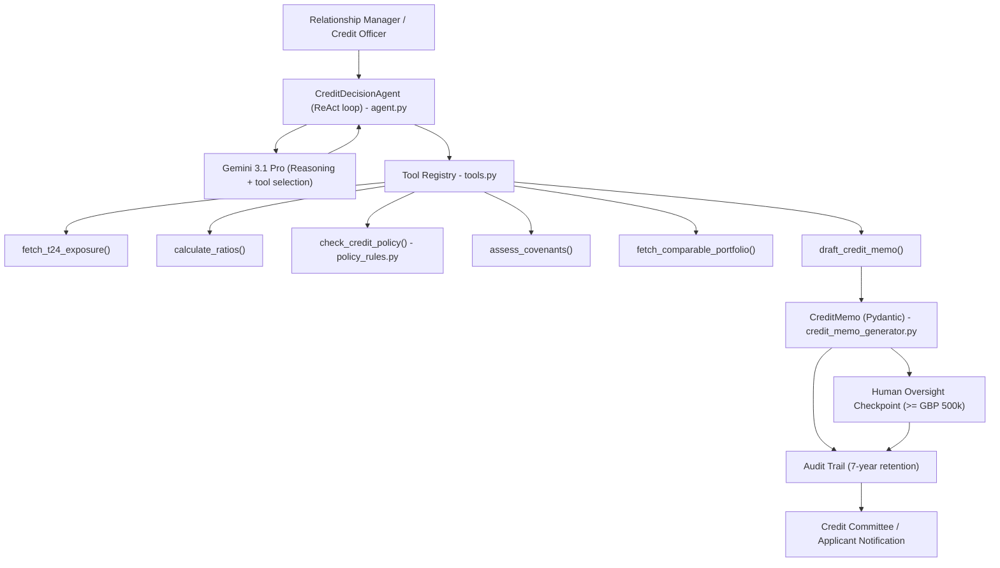
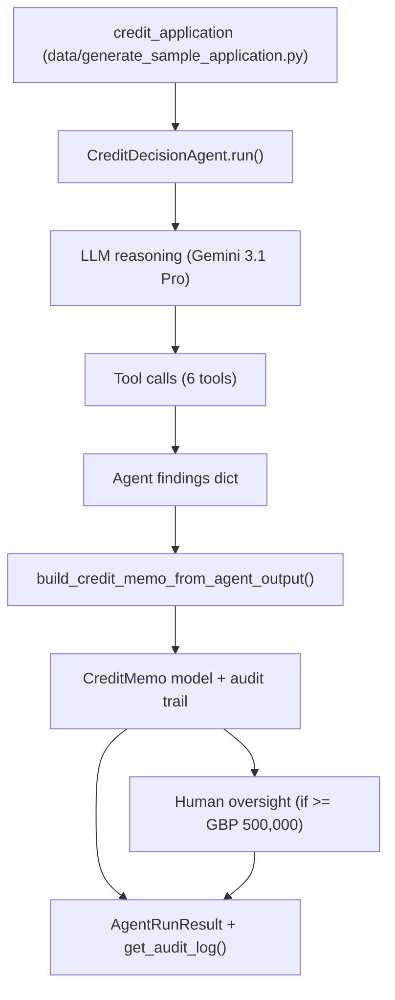
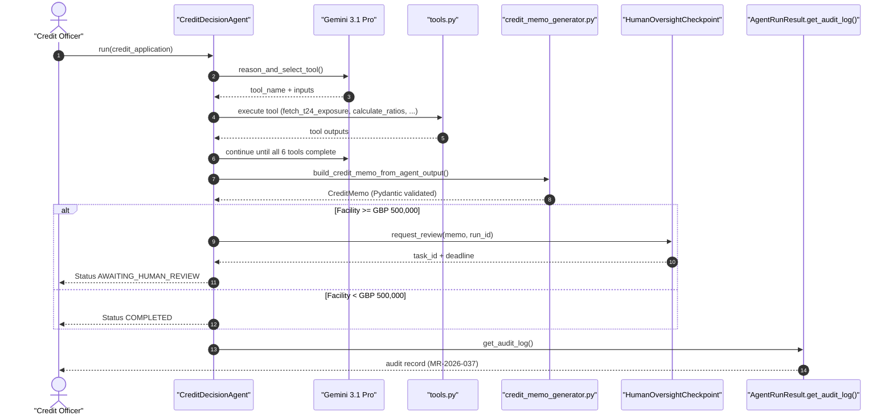

# Chapter 3 — AWB Automated Credit Decision Workflow

[](https://opensource.org/licenses/MIT)
[](https://www.python.org/downloads/)
[](https://github.com/psf/black)

> ReAct-loop credit decision agent with LangGraph pipeline, parallel treasury operations, dual-store memory, streaming events, MCP server catalogue, and multi-agent guardrail framework.

*Companion code for **"AI for Financial Risk, Compliance and Regulatory Reporting"** | AWB-AI-2025 Programme*

---

## Chapter 3 - AWB Automated Credit Decision Workflow

**AI for Financial Risk, Compliance and Regulatory Reporting**
*Avon & Wessex Bank plc (AWB) - AWB-AI-2025 Programme*

---

### Overview

This codebase implements the AWB Automated Credit Decision Workflow described in Chapter 3
of *AI for Financial Risk, Compliance and Regulatory Reporting: The Enterprise
Implementation Guide*.

The workflow uses a ReAct (Reason + Act) agent loop to assess corporate credit
applications, apply AWB policy rules, benchmark peers, recommend covenants,
and produce a structured credit memorandum with a full audit trail.

**Annual saving:** £2.1M (base case — see Section 3.4 for full derivation)  
**Payback period:** 4 months  
**Monthly AI cost:** £620 (Gemini 3.5 Flash 80% + Claude Sonnet 4.6 20% for covenant analysis)

---

### Architecture



---

### Data Flow



---

### Sequence Diagram



---

### Regulatory Compliance

| Obligation | Implementation |
|------------|----------------|
| PRA SS1/23 | Model registration MR-2026-037; tool-call logs + audit trail retained 7 years |
| EU AI Act 2024 Article 14 | Human-in-the-loop mandatory for facilities >= GBP 500,000 |
| EU AI Act 2024 Annex III | Credit scoring listed as high-risk; policy rules and memo stored as evidence |
| FCA Consumer Duty PS22/9 | Plain-English rationale in credit memo; customer outcome traceable |
| UK GDPR Article 22 | Automated decision explanation recorded in memo and audit trail |
| DORA Article 6 | Graceful degradation if tool or LLM fails; no hard-stop on individual tool errors |

---

### Quick Start

```bash
# 1. Install dependencies
pip install -r requirements.txt

# 2. Set Google AI Studio API key
export GOOGLE_API_KEY="your_key_here"
# Get free key at: https://aistudio.google.com/app/apikey

# 3. Run tests (no API key required for unit tests)
pytest tests/ -v -k "not live"

# 4. Run all tests including live API
GOOGLE_API_KEY=your_key pytest tests/ -v

# 5. Run an end-to-end agent demo
python -c "
from data.generate_sample_application import generate
from credit_agent.agent import CreditDecisionAgent

application = generate('base')
agent = CreditDecisionAgent()
result = agent.run(application, auto_approve_human_review=True)

print(f'Run ID: {result.run_id}')
print(f'Status: {result.status.value}')
print(f'Recommendation: {result.credit_memo.recommendation.value}')
print(f'Human review required: {result.credit_memo.human_review_required}')
print(f'Memo ID: {result.credit_memo.memo_id}')
"
```

---

### File Structure

```
ch3_credit_agent/
|-- credit_agent/
|   |-- __init__.py
|   |-- agent.py                 # ReAct loop + human oversight checkpoint
|   |-- tools.py                 # Tool definitions + registry
|   |-- policy_rules.py          # AWB credit policy thresholds and breaches
|   |-- credit_memo_generator.py # Pydantic CreditMemo model + audit trail
|   |-- agent_evaluation.py      # Section 3.9C: golden trajectories, LLM-as-judge, reliability SLOs, regression gate
|-- data/
|   |-- generate_sample_application.py
|-- tests/
|   |-- test_credit_agent.py     # 50+ tests across tools, policy, memo, HITL
|-- requirements.txt
|-- README.md
```

---

### Cost Derivation (£GBP) — Section 3.4

| Component | Monthly Cost |
|-----------|-------------|
| Gemini 3.5 Flash reasoning (80% of calls, ~1.76B tokens x £0.24/1M) | £422 |
| Claude Sonnet 4.6 covenant analysis (20% of calls, ~84M tokens x £2.36/1M) | £198 |
| **Total monthly AI cost** | **£620** |

> **Pricing note:** The per-token rates above are AWB's *effective* blended rates after volume, batch (−50%), and prompt-cache (−90% on cached input) discounts on this caching-heavy workload. The standard list prices are higher — see `docs/appendices/tech-stack.md` and current vendor pricing at anthropic.com, openai.com, and ai.google.dev. Re-derive with your own volumes and contracted rates.

**ROI Assumptions (base case — AWB internal estimates, June 2026):**
- 450 corporate credit assessments per month
- 12 credit analysts × 50% time on document analysis and RWA calculation
- Fully loaded analyst cost: £68,000/year (£48,500 salary + 40% overhead)
- Automation rate: 70% of document analysis and RWA calculation steps
- Credit conversion improvement: 3% recovery of applications lost to processing speed

**Annual saving calculation:**
- Direct labour saving: 12 analysts × £68,000 × 50% × 70% = **£285,600/year**
- Credit conversion improvement: 3% × £28B portfolio × 15% new business rate = **£1,820,000/year**
- **Total annual saving (base case): £2.1M**
- Monthly AI cost: £620 → Annual AI cost: £7,440
- **Net annual saving: ~£2.09M**

**Sensitivity analysis:**

| Scenario | Annual Net Saving | 3-Year NPV (8%) |
|----------|------------------|-----------------|
| Conservative (50% automation, no conversion uplift) | £285,600 | £736,000 |
| Base case (70% automation + 3% conversion uplift) | £2,100,000 | £5,408,000 |
| Optimistic (85% automation + 5% conversion uplift) | £3,318,000 | £8,546,000 |

**Payback period:** 4 months (build cost £38,000 ÷ (£2.1M ÷ 12))

> USD conversion at £1 = $1.27 (June 2026) when comparing with US benchmark systems.

---

### LLM Selection Rationale

**Gemini 3.1 Pro** selected for this use case because:
- Strong reasoning and tool-selection performance for multi-step ReAct loops
- Robust function-calling support for structured tool inputs
- Long-context capacity for policy and application data

**Gemini 3.5 Flash** selected for this use case because:
- Cost-efficient drafting of memo summaries and rationale text
- Low latency for high-throughput credit memo generation

*Models from approved June 2026 list only.
Never use: GPT-4, Claude 3.5 Sonnet, Gemini 3 (deprecated).*

---

## Section 3.9A — Agentic AI Architecture Patterns

`credit_agent/agentic_ai_patterns.py` formalises the multi-agent topology,
guardrail framework, and ReAct loop used throughout the AWB credit pipeline.

### Key classes

| Class | Purpose |
|---|---|
| `AgentTopology` | Enum — SEQUENTIAL, PARALLEL, SUPERVISOR_WORKER, HIERARCHICAL |
| `RiskZone` | Enum — GREEN → AMBER → RED → CRITICAL (monotonically upward only) |
| `ReActLoop` | Full Reason-then-Act iteration tracker with per-step logging |
| `ReActStep` | Dataclass — seq, agent, timestamp, reason, act, outcome |
| `GuardrailTier` | Enum — INPUT, PROCESS, OUTPUT |
| `Guardrail` | Dataclass — name, tier, check function, block-on-fail flag |
| `GuardrailRegistry` | Registry with `evaluate_all(input_text, output_text)` |
| `AgentRunBudget` | Hard caps: TOKEN_BUDGET_PER_RUN=50,000, COST_BUDGET_GBP=2.50 |
| `BudgetExceededError` | Raised when either cap is breached |
| `SupervisorWorkerOrchestrator` | Fan-out/fan-in with supervisor LLM routing |
| `validate_agent_output` | Cross-tier output schema validator |

### Architecture constants

```python
TOKEN_BUDGET_PER_RUN      = 50_000   # hard cap — aborts run on breach
COST_BUDGET_GBP_PER_RUN   = 2.50     # hard cap — aborts run on breach
AWB_AGENT_ARCHITECTURE_MAP = {
    "agents_1_3": AgentTopology.SEQUENTIAL,
    "agent_4":    AgentTopology.PARALLEL,
    "agent_5":    AgentTopology.SUPERVISOR_WORKER,
}
```

### LLM allocation

| Agents | Model | Rationale |
|---|---|---|
| Agents 1-3 | `gemini-3.5-flash` | Cost-efficient, high-throughput reasoning |
| Agent 4 | `gemini-3.1-pro` | Complex multi-dimensional analysis |
| Agent 5 | `claude-sonnet-4-6` | Nuanced narrative generation + HITL |

### AWB Agent Architecture Map

```
AWB_LLM_AGENTS_1_3 = gemini-3.5-flash  (doc ingestion, financial analysis, policy check)
AWB_LLM_AGENT_4   = gemini-3.1-pro     (memo drafting — multi-table reasoning)
AWB_LLM_AGENT_5   = claude-sonnet-4-6  (HITL summary — regulatory narrative)
```

---

## Section 3.9B — MCP Server Catalogue

`credit_agent/mcp_servers.py` implements the Anthropic Model Context Protocol
(MCP) connector layer, giving AWB agents structured, audited access to
external regulatory and market data sources.

### Registered MCP servers

| Server | Class | Tools | Data source |
|---|---|---|---|
| FCA Handbook | `MCPFCAHandbookServer` | `search_handbook`, `get_sourcebook_rule`, `get_ps_guidance`, `list_recent_updates` | FCA regulatory handbook |
| Bloomberg Terminal | `MCPBloombergServer` | `get_company_financials`, `get_credit_ratings`, `get_market_data`, `get_peer_comparables` | Bloomberg data feed |
| AWB Model Inventory | `MCPModelInventoryServer` | `get_model_card`, `list_models_by_risk`, `get_validation_status`, `check_deployment_gate` | Internal SS1/23 registry |

### Core dataclasses

```python
@dataclass
class MCPToolDefinition:
    name: str
    description: str
    input_schema: dict[str, Any]
    output_schema: dict[str, Any]

@dataclass
class MCPCallAuditRecord:
    call_id: str
    server_name: str
    tool_name: str
    inputs: dict
    outputs: dict
    duration_ms: float
    timestamp: datetime
    model_ref: str
    cost_gbp: float
```

### AWBMCPServerRegistry

```python
registry = AWBMCPServerRegistry()
result = await registry.call("fca_handbook", "search_handbook",
                             {"query": "SS1/23 model risk", "max_results": 5})
```

All MCP calls are SHA-256 hashed and written to the AWB audit log.
Per-call budget enforcement: TOKEN_BUDGET_PER_RUN / COST_BUDGET_GBP_PER_RUN.

### Model registrations

- **MR-2026-037** — Credit Decision Agent (PRA SS1/23)
- **MR-2026-038** — Treasury Operations Agent (PRA SS1/23)
