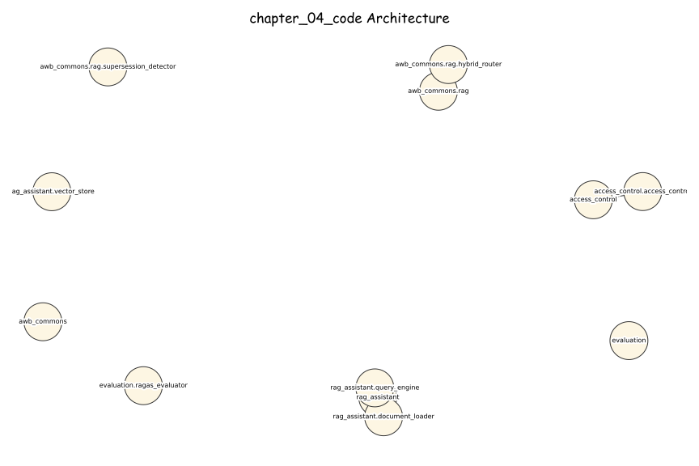
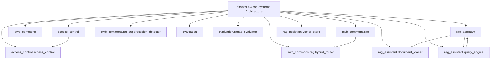

# AI Banking Risk Platform

[](https://opensource.org/licenses/MIT)
[](https://www.python.org/downloads/)
[](https://github.com/psf/black)

> **Production-ready AI/ML implementations for banking risk, compliance, 
> and regulatory reporting**

Companion code repository for the book **"AI for Financial Risk, Compliance 
and Regulatory Reporting: The Enterprise Implementation Guide"**

## 🎯 What's Included

- ✅ **16 Complete Chapters** - From foundations to production deployment
- ✅ **50+ Production Systems** - Real, deployable implementations
- ✅ **40,000+ Lines of Code** - Tested Python code
- ✅ **5 Risk Domains** - Credit, Market, Operational, Liquidity, Model Risk
- ✅ **Compliance & Regulatory** - AML/KYC, Basel III, GDPR
- ✅ **Enterprise Architecture** - Microservices, MLOps, Data Infrastructure

## Chapter 4 — AWB Regulatory Knowledge Assistant

**AI for Financial Risk, Compliance and Regulatory Reporting**
*Avon & Wessex Bank plc (AWB) — AWB-AI-2025 Programme*
*github.com/lorvenio/ai-banking-risk-platform*

---

### Overview

This package implements the four production RAG systems described in Chapter 4.

| System | Section | DORA ICT ID | Annual Saving |
|--------|---------|-------------|---------------|
| AWB Regulatory Knowledge Assistant | 4.4 | RKA-2026-001 | £180K/year |
| FCA Product Suitability Adviser | 4.3 | PSA-2026-001 | £59.9K/year |
| Hybrid RAG Router | 4.6 | — | Component |
| Multi-Tenant Access Control | 4.9 | — | Component |

**PRA SS1/23 registered model:** MR-2026-038 (LOW risk)
**Monthly running cost:** £145/month | **Build time:** 4 weeks

---

### Agentic AI Pipeline — Section 4.9

`rag_assistant/agentic_rag.py` implements the **AWB Multi-Hop Regulatory Query Agent** — a LangGraph
StateGraph that decomposes complex regulatory questions into sub-queries, retrieves across multiple
ChromaDB collections, re-ranks with BM25, and synthesises a cited answer with RAGAS evaluation:

```
START → QueryDecomposer → MultiHopRetriever → RerankFusion → AnswerSynthesiser → RAGASEvaluator → HITL → END
```

```bash
python -c "
import asyncio
from rag_assistant.agentic_rag import run_agentic_rag
asyncio.run(run_agentic_rag('What are the PRA SS1/23 requirements for model validation?'))
"
```

---

### GraphRAG — Section 4.9.4

`rag_assistant/graph_rag.py` implements **GraphRAGEngine** — a hybrid retrieval engine that fuses
pgvector semantic search with bounded (<= 3 hop) Neo4j graph traversal over a five-node-type
regulatory knowledge graph (`Regulation` / `Clause` / `Control` / `System` / `Filing`, linked by
`IMPLEMENTS` / `SUPERSEDES` / `FEEDS` / `CROSS_REFERENCES` edges). It supplements — never replaces
— the vector store, and a lightweight classifier invokes graph traversal only for queries that need
relational reasoning (control-to-clause lineage, cross-regulatory traceability, superseded-
regulation impact analysis):

```
Query → pgvector entry-point match → [classifier: needs graph?] → bounded Cypher traversal
      → fuse vector + graph context → LLM synthesis → GraphRAGResult (cited, audit-logged)
```

```python
from rag_assistant.graph_rag import GraphRAGEngine, Neo4jGraphStore

engine = GraphRAGEngine(
    vector_store=store,                 # RegulatoryVectorStore (Section 4.4)
    graph_store=Neo4jGraphStore(driver=neo4j_driver),
    llm_client=llm,
)
result = engine.query("Which controls need to change if CRR3 Article 122a is amended?")
print(result.answer)
print(f"Used graph traversal: {result.used_graph_traversal}")
```

---

### Quick Start

```bash
git clone https://github.com/lorvenio/ai-banking-risk-platform.git
cd ai-banking-risk-platform/chapter_04
pip install -r requirements.txt
pytest tests/ -v                                # 125 tests, no API key needed
pytest tests/test_ch04_new_modules.py -v        # 45 tests for Sections 4.6-4.9
pytest tests/test_graph_rag.py -v               # 29 tests for Section 4.9.4 GraphRAG
```

---

### Package Structure

```
chapter_04/
├── rag_assistant/              # Core RKA — Section 4.4
│   ├── document_loader.py      # Chunking + regulatory metadata registry
│   ├── vector_store.py         # ChromaDB + embedding provider
│   ├── query_engine.py         # RAG pipeline + hallucination guard
│   ├── agentic_rag.py          # AgenticRAGEngine — ReAct multi-hop agent (4.9.3)
│   ├── graph_rag.py            # GraphRAGEngine — hybrid vector+graph retrieval (4.9.4)
│   └── regulatory_documents/   # PRA, FCA PS22/9, EU AI Act, DORA
├── awb_commons/rag/
│   ├── hybrid_router.py        # DOCUMENT/DATA/HYBRID classification (4.6)
│   └── supersession_detector.py # DRAFT/FINAL/SUPERSEDED lifecycle (4.7)
├── evaluation/
│   └── ragas_evaluator.py      # AWBRagasEvaluator — PRA SS1/23 (4.8)
├── access_control/
│   └── access_control.py       # 4-tier access + 7-yr audit log (4.9)
├── exercises/
│   ├── product_faq.py          # Exercise 4.1 starter
│   └── exercise_2.py           # Exercise 4.2 starter
└── tests/
    ├── test_rag_assistant.py   # 51 tests — core pipeline
    ├── test_ch04_new_modules.py # 45 tests — Sections 4.6-4.9
    └── test_graph_rag.py       # 29 tests — Section 4.9.4 GraphRAG
```

---

### Section Guide

#### 4.6 Hybrid Router
```python
from awb_commons.rag.hybrid_router import HybridRouter, QueryType
router = HybridRouter()
result = router.classify("Is our LCR compliant with CRR3 minimums?")
print(result.query_type)   # QueryType.HYBRID
```

#### 4.7 Supersession Detector
```python
from awb_commons.rag.supersession_detector import SupersessionDetector
detector = SupersessionDetector(similarity_threshold=0.85)
result = detector.detect_and_mark("CRR3_final_2024", corpus_client)
print(f"Marked {result.superseded_count} documents SUPERSEDED")
```

#### 4.8 RAGAS Evaluator
```python
from evaluation.ragas_evaluator import AWBRagasEvaluator
evaluator = AWBRagasEvaluator(use_mock=True)
result = evaluator.validate("MR-2026-038", "evaluation/test_set.json")
print(result.summary())
# MR-2026-038 [PASS] faithfulness=0.910 relevancy=0.880 ...
```

#### 4.9 Access Control
```python
from access_control.access_control import AccessTier, build_access_filter
f = build_access_filter(AccessTier.CREDIT_ANALYST)
# {"document_category": {"$in": ["credit", "capital", "model_risk", ...]}}
```

---

### Validation Thresholds (MR-2026-038)

| RAGAS Metric | AWB Threshold | PRA SS1/23 Mapping |
|-------------|--------------|-------------------|
| Faithfulness | >= 0.85 | Model output traceability |
| Answer Relevancy | >= 0.80 | Fitness for purpose |
| Context Precision | >= 0.75 | Retrieval accuracy |
| Context Recall | >= 0.70 | Completeness of evidence |

---

### LLM Approved Models (June 2026)

| Provider | Model | AWB Use |
|----------|-------|---------|
| Google | Gemini 3.5 Flash | Production primary (68%) |
| Google | Gemini 3.1 Pro | Complex reasoning |
| OpenAI | GPT-5.5 | Alternative |
| Anthropic | Claude Sonnet 4.6 | Highest reasoning |

Change model: set `MODEL_ID` environment variable in query_engine.py.

---

### Regulatory Compliance

| Obligation | Implementation |
|-----------|----------------|
| PRA SS1/23 | MR-2026-038 registered (LOW risk); RAGAS validation evidence; audit log |
| FCA PS22/9 | Eligibility filter before generation; mandatory citations |
| EU AI Act | Confidence gate 0.65; human oversight hook; conformity docs (Aug 2026) |
| DORA Art. 9 | ICT asset RKA-2026-001; Google API dependency documented |
| FCA COBS 9 | 7-year RAGAuditRecord retention in PostgreSQL |

*Avon & Wessex Bank plc is entirely fictional. Any resemblance to actual institutions is coincidental.*

### Architecture Diagrams

#### Excalidraw-Style (Hand-Drawn)



#### Mermaid




