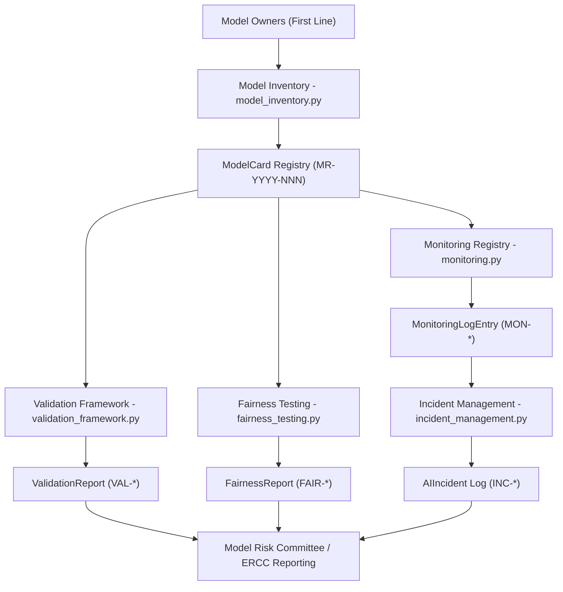
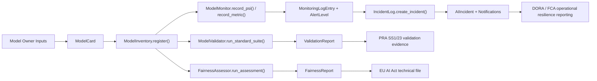
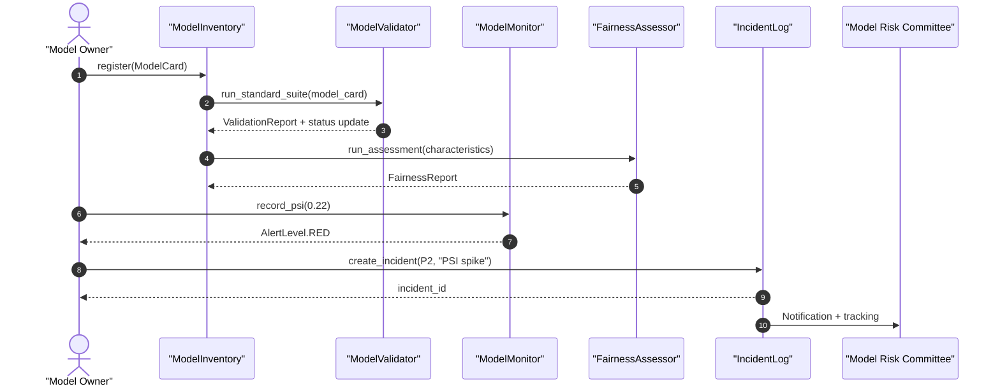
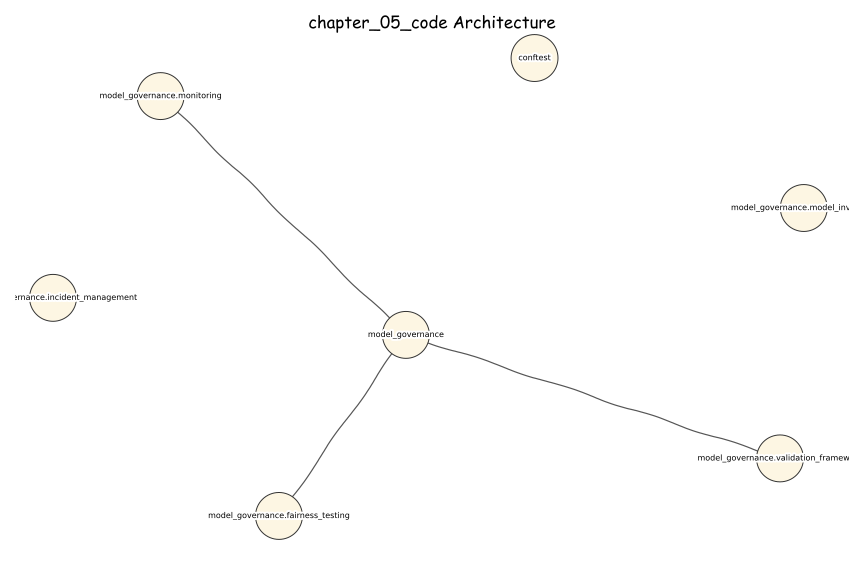
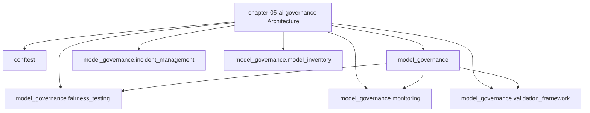

# Chapter 5 — AWB AI Governance Platform

[](https://opensource.org/licenses/MIT)
[](https://www.python.org/downloads/)
[](https://github.com/psf/black)

> PRA SS1/23 AI governance — model inventory, validation framework, drift monitoring, incident management, fairness testing, SS1/23 4-gate deployment gate, and 23-model registry snapshot.

*Companion code for **"AI for Financial Risk, Compliance and Regulatory Reporting"** | AWB-AI-2025 Programme*

---

## Chapter 5 - AWB AI Governance Platform

**AI for Financial Risk, Compliance and Regulatory Reporting**
*Avon & Wessex Bank plc (AWB) - AWB-AI-2025 Programme*

---

### Overview

This codebase implements the AWB AI Governance Platform described in Chapter 5
of *AI for Financial Risk, Compliance and Regulatory Reporting: The Enterprise
Implementation Guide*.

The platform provides a PRA SS1/23 compliant governance layer covering model
inventory, validation reporting, ongoing monitoring, incident management, and
fairness testing for AWB's AI and traditional models.

**Annual saving:** GBP 0.41M  
**Payback period:** ~ 4.5 months  
**Monthly running cost:** GBP 72 (no LLM cost)

---

### Architecture



---

### Data Flow



---

### Sequence Diagram



---

### Regulatory Compliance

| Obligation | Implementation |
|------------|----------------|
| PRA SS1/23 | Model inventory registry, validation reports, ongoing monitoring, 7-year audit evidence |
| EU AI Act 2024 | EUAIActClassification on ModelCard; fairness testing and serious incident flagging |
| DORA | Monitoring alerts and incident classification aligned to ICT incident reporting |
| FCA PS21/3 | Incident severity and notification deadlines for operational resilience |
| UK Equality Act 2010 | Demographic parity, equal opportunity, and disparate impact tests |

---

### Quick Start

```bash
# 1. Install dependencies
pip install -r requirements.txt

# 2. Set Google AI Studio API key
# No API keys required (governance framework is offline and rules-based)

# 3. Run tests (no API key required)
pytest tests/ -v

# 4. Run full test suite (identical - no live API calls)
pytest tests/ -v

# 5. Interactive governance demo
python -c "
from model_governance.model_inventory import build_awb_model_inventory
from model_governance.validation_framework import ModelValidator
from model_governance.monitoring import ModelMonitor
from model_governance.incident_management import IncidentLog, classify_incident_severity
from model_governance.fairness_testing import FairnessAssessor, GroupStatistics

inventory = build_awb_model_inventory()
model = inventory.get('MR-2026-036')

report = ModelValidator.run_standard_suite(
    model_card=model,
    gini=0.58,
    psi=0.12,
    accuracy=0.86,
)

monitor = ModelMonitor(model.model_id, model.model_name)
entry = monitor.record_psi(0.22, feature_name='income')

incident_log = IncidentLog()
severity = classify_incident_severity(performance_degraded=True)
incident = incident_log.create_incident(
    model_id=model.model_id,
    model_name=model.model_name,
    severity=severity,
    title='PSI spike detected',
    description=entry.notes,
)

assessor = FairnessAssessor()
stats = [
    GroupStatistics('Group_A', 'gender', approval_rate=0.70, true_positive_rate=0.82),
    GroupStatistics('Group_B', 'gender', approval_rate=0.62, true_positive_rate=0.78),
]
fairness = assessor.run_assessment(
    model_id=model.model_id,
    model_name=model.model_name,
    characteristics={'gender': (stats, 'Group_A')},
)

print(f'Inventory size: {len(inventory)}')
print(f'Validation result: {report.overall_result.value}')
print(f'Latest PSI alert: {entry.alert_level.value}')
print(f'Incident ID: {incident.incident_id}')
print(f'Fairness result: {fairness.overall_result.value}')
"
```

---

### File Structure

```
ch5_governance/
|-- model_governance/
|   |-- __init__.py
|   |-- model_inventory.py        # Model cards + PRA SS1/23 inventory
|   |-- validation_framework.py   # Validation tests + validation reports
|   |-- monitoring.py             # PSI monitoring + alert registry
|   |-- incident_management.py    # Incident log + notification rules
|   |-- fairness_testing.py       # Fairness metrics + reporting
|   |-- agentic_governance.py     # Section 5.8B: autonomy levels, trajectory validation, kill-switch controls, agent change mgmt
|-- data/
|   |-- generate_sample_model_inventory.py
|-- tests/
|   |-- test_model_governance.py  # 56 tests across 7 sections
|-- conftest.py
|-- README.md
```

---

### Cost Derivation (GBP)

| Component | Monthly Cost |
|-----------|-------------|
| AWS ECS (1 task x t3.small) | GBP 22 |
| PostgreSQL RDS (db.t3.small) | GBP 30 |
| S3 audit storage (200 GB) | GBP 4 |
| CloudWatch logs + metrics | GBP 6 |
| Internal API gateway | GBP 4 |
| Backup / DR snapshots | GBP 6 |
| **Total** | **GBP 72/month** |

**Assumptions (default scenario):**
- 150 models in the inventory (mix of LOW to CRITICAL)
- 3 hours/month of manual monitoring and reporting per model
- 70% effort reduction from automated monitoring, reporting, and incident workflows
- 24 validation exercises per year (2 per month)
- 40 hours manual effort per validation; 50% automated via standard suites
- Model risk analyst cost: GBP 95/hour (fully loaded)
- Implementation cost: GBP 150,000 (one-off)

**Annual saving calculation:**
- Monitoring savings: 150 models x 3 hours/month x 70% x GBP 95 x 12 =
  **GBP 359,100/year**
- Validation savings: 24 validations x 20 hours saved x GBP 95 =
  **GBP 45,600/year**
- **Total annual saving:** **GBP 404,700/year**

**Estimated monthly LLM cost calculation:**
- No LLM usage in this framework (rules-based governance only) =
  **GBP 0/month**

**Payback period:** GBP 150,000 / (GBP 404,700 / 12) = **~ 4.5 months**

---

### LLM Selection Rationale

No LLM is used in this chapter. The governance framework is intentionally
rules-based to provide deterministic, auditable controls for PRA SS1/23
compliance. Where LLMs are used in Chapters 1 to 4, this platform governs them
through inventory registration, validation, monitoring, incident management,
and fairness testing.

*Models from approved June 2026 list only.
Never use: GPT-4, Claude 3.5 Sonnet, Gemini 3 (deprecated).*

### Architecture Diagrams

#### Excalidraw-Style (Hand-Drawn)



#### Mermaid



---

## Section 5.8A — SS1/23 Deployment Gate and Operational MRM

`model_governance/operational_mrm.py` extends the governance platform with
a machine-executable SS1/23 deployment gate, production drift monitor, prompt
version manager, and a full snapshot of AWB's 23-model registry.

### SS123DeploymentGate

Four-gate CI/CD hard-block that prevents any model from reaching production
without passing all PRA SS1/23 thresholds.

| Gate | Metric | Threshold | Action on fail |
|---|---|---|---|
| Gate 1 | AUC-ROC | ≥ 0.70 | Block — revalidate |
| Gate 2 | Gini delta vs champion | ≤ 5 pp | Block — revalidate |
| Gate 3 | Population Stability Index | ≤ 0.20 | Block — retrain |
| Gate 4 | Output floor (CRR3 Art.72e) | ≥ 55% | Block — recalibrate |

```python
gate = SS123DeploymentGate()
result = gate.validate(DeploymentGateInput(
    model_ref="MR-2026-037",
    auc_roc=0.82,
    gini_delta=0.03,
    psi=0.12,
    output_floor=0.58,
    validated_by="Sarah Chen",
    validation_date=date.today(),
))
# result.passed → True / False
# result.audit_hash → SHA-256 of all inputs
```

### ProductionDriftMonitor

Continuous PSI and SHAP drift assessment with automatic zone escalation.

| Metric | WARN threshold | BREACH threshold | Zone | Action |
|---|---|---|---|---|
| PSI | 0.10 | 0.20 | AMBER / RED | AMBER = monitor; RED = mandatory retrain |
| SHAP drift | 15% | 25% | AMBER / RED | AMBER = review; RED = ad-hoc validation |

### PromptVersionManager

SemVer prompt change registry with RAGAS rollback guard.

| Change type | Version bump | Approval required |
|---|---|---|
| MAJOR | X.0.0 | Regulatory approval (signed) |
| MINOR | 0.Y.0 | MR sign-off |
| PATCH | 0.0.Z | None |

- RAGAS faithfulness < 0.80 → `ValueError` — automatic rollback within 15 minutes
- All versions SHA-256 hashed and stored in AWB model registry

### ModelRegistryClient

Complete read interface over `AWB_MODEL_REGISTRY` — 23 production systems
(MR-2026-035 through MR-2026-074-IP).

```python
client = ModelRegistryClient()
client.get("MR-2026-037")                    # single model card
client.get_by_drift_status("AMBER")          # filtered by PSI status
client.get_overdue_validations(date.today()) # past 12-month review date
client.summary()                             # aggregate counts by risk/status
```

### Key constants

```python
SS123_MIN_AUC_ROC          = 0.70   # Gate 1 floor
SS123_MAX_GINI_DELTA       = 0.05   # Gate 2 ceiling (5 pp)
SS123_MAX_PSI              = 0.20   # Gate 3 ceiling
SS123_MIN_OUTPUT_FLOOR_2026 = 0.55  # Gate 4 floor (CRR3 Art.72e)
PSI_WARN_THRESHOLD         = 0.10   # AMBER alert
PSI_BREACH_THRESHOLD       = 0.20   # RED + mandatory retrain
RAGAS_FAITHFULNESS_ROLLBACK = 0.80  # Auto-rollback trigger
RAGAS_ROLLBACK_SLA_MINUTES = 15     # Max rollback window
```
