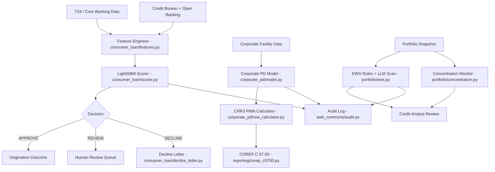
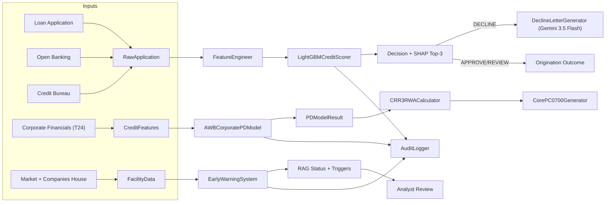
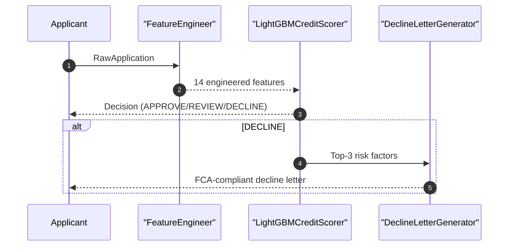
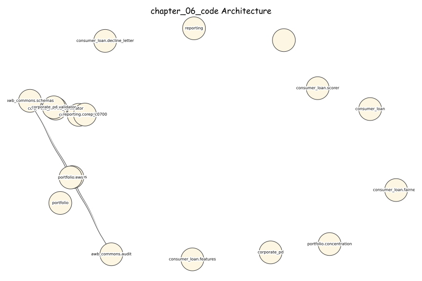

# AI Banking Risk Platform

[](https://opensource.org/licenses/MIT)
[](https://www.python.org/downloads/)
[](https://github.com/psf/black)

> **Production-ready AI/ML implementations for banking risk, compliance, 
> and regulatory reporting**

Companion code repository for the book **"AI for Financial Risk, Compliance 
and Regulatory Reporting: The Enterprise Implementation Guide"**

## 🎯 What's Included

- ✅ **16 Complete Chapters** - From foundations to production deployment
- ✅ **50+ Production Systems** - Real, deployable implementations
- ✅ **40,000+ Lines of Code** - Tested Python code
- ✅ **5 Risk Domains** - Credit, Market, Operational, Liquidity, Model Risk
- ✅ **Compliance & Regulatory** - AML/KYC, Basel III, GDPR
- ✅ **Enterprise Architecture** - Microservices, MLOps, Data Infrastructure

## Chapter 6 - Credit Risk Intelligence with AI

**AI for Financial Risk, Compliance and Regulatory Reporting**
*Avon & Wessex Bank plc (AWB) - AWB-AI-2025 Programme*

---

### Overview

This codebase implements the Chapter 6 credit risk intelligence stack across:
corporate PD modeling (MR-2026-040), consumer loan origination (MR-2026-041),
portfolio early-warning monitoring (MR-2026-042), and COREP C 07.00 reporting.

| Model ID | System | SS1/23 Risk | EU AI Act |
|----------|--------|-------------|-----------|
| MR-2026-040 | AWB Corporate PD Model (XGBoost + SHAP) | HIGH | HIGH-RISK Annex III 5(b) |
| MR-2026-041 | Consumer Loan Origination (LightGBM) | MEDIUM | HIGH-RISK Annex III 5(b) |
| MR-2026-042 | EWS LLM News Scanner (Gemini 3.5 Flash) | LOW | Limited |
| MR-2026-055-AGT | Credit Intelligence Monitor — Agentic (Section 6.3A) | HIGH | HIGH-RISK Annex III 5(b) |

**Annual saving:** GBP 0.99M  
**Payback period:** < 2 months  
**Monthly running cost:** GBP 50 (GBP 11 LLM + GBP 39 infrastructure)

---

### Architecture (Mermaid)



---

### Data Flow (Mermaid)



---

### Sequence Diagram (Mermaid)



---

### Regulatory Compliance

| Obligation | Implementation |
|------------|----------------|
| CRR3 Art. 153 | `corporate_pd/rwa_calculator.py` IRB RWA formula |
| CRR3 Art. 160 | PD floor 0.03% in `corporate_pd/model.py` and `rwa_calculator.py` |
| CRR3 Art. 174 | 7-year training window (2018-2024) in `corporate_pd/model.py` |
| CRR3 Art. 176 | Full validation suite in `corporate_pd/validator.py` |
| CRR3 Art. 180 | Long-run PD deviation checks in `validator.py` |
| FCA PS22/9 | Fairness monitor and decline letter rules in `consumer_loan/fairness.py` and `consumer_loan/decline_letter.py` |
| FCA COBS 9 | 7-year audit retention in `awb_commons/audit.py` |
| Consumer Credit Act 1974 | CRA disclosure in decline letters (`decline_letter.py`) |
| PRA SS1/23 | Model risk ratings + audit evidence across all models |
| EU AI Act Annex III 5(b) | Consumer and corporate creditworthiness use cases |
| DORA | ICT assets: CLO-2026-001, PD-2026-040, EWS-2026-001 |

---

### Agentic AI Pipeline — Section 6.3A

`agentic_cim.py` implements the **Credit Intelligence Monitor (CIM)** — a LangGraph StateGraph
with five specialist agents (MR-2026-055-AGT):

```
START → DataIngestion → CreditAnalysis → RegulatoryCheck → RiskSynthesis → DecisionAgent → HITL → END
```

- **Agent 1–3** (Gemini 3.5 Flash): data ingestion, PD/LGD/EAD computation, CRR3 RWA calculation
- **Agent 4** (Gemini 3.1 Pro): multi-factor risk synthesis, IFRS 9 staging
- **Agent 5 + HITL** (Claude Sonnet 4.6): regulatory narrative, mandatory human gate for exposures > £500K

```bash
python -c "
import asyncio
from agentic_cim import run_credit_intelligence_monitor
asyncio.run(run_credit_intelligence_monitor())
"
```

---

### Quick Start

```bash
# 1. Install dependencies
pip install -r requirements.txt

# 2. Set Google AI Studio API key (for decline letters + EWS news scan)
export GOOGLE_API_KEY="your_key_here"

# 3. Run tests (no API key required for unit tests)
pytest tests/ -v

# 4. Run all tests including live API
GOOGLE_API_KEY=your_key pytest tests/ -v

# 5. Interactive demo: consumer loan decline pipeline
python -c "
from consumer_loan.features import FeatureEngineer, RawApplication
from consumer_loan.scorer import LightGBMCreditScorer
from consumer_loan.decline_letter import DeclineLetterGenerator

app = RawApplication(
    application_id='APP-001',
    requested_amount_gbp=8000.0,
    loan_term_months=36,
    purpose='home_improvement',
    gross_annual_income=42000.0,
    employment_status='employed',
    employment_tenure_months=48,
    residential_status='owner',
    time_at_address_months=60,
    num_dependants=1,
    monthly_housing_cost=900.0,
    existing_monthly_commitments=250.0,
    bureau_score=520,
    bureau_adverse_flag=1,
    bureau_utilisation=0.55,
    ob_connected=False,
)

features = FeatureEngineer().engineer(app)
scorer = LightGBMCreditScorer.build_stub()
result = scorer.predict(app.application_id, features)
print(f'Decision: {result.decision} PD={result.pd_calibrated:.3f}')

if result.decision == 'DECLINE':
    letter = DeclineLetterGenerator().generate(app.application_id, result.shap_top3_risk)
    print(letter.letter_text[:200] + '...')
"
```

Get a free key at [Google AI Studio API key](https://aistudio.google.com/app/apikey).

---

### File Structure

```
chapter-06-credit-risk/
|-- awb_commons/
|   |-- schemas.py          # Shared contracts (CreditFeatures, PDModelResult)
|   |-- audit.py            # 7-year audit log (FCA COBS 9, PRA SS1/23)
|-- consumer_loan/
|   |-- features.py         # Feature engineering + Open Banking imputation
|   |-- scorer.py           # LightGBM scorer + Platt + SHAP (MR-2026-041)
|   |-- fairness.py         # FCA PS22/9 fairness monitor
|   |-- decline_letter.py   # Gemini 3.5 Flash decline letters
|-- corporate_pd/
|   |-- model.py            # XGBoost + Platt + SHAP (MR-2026-040)
|   |-- validator.py        # CRR3 Art. 176 validation suite
|   |-- rwa_calculator.py   # CRR3 Art. 153 IRB RWA + output floor
|-- portfolio/
|   |-- ews.py              # 12-trigger EWS + LLM news scanner (MR-2026-042)
|   |-- concentration.py    # HHI concentration monitor
|-- reporting/
|   |-- corep_c0700.py       # COREP C 07.00 generator
|-- tests/
|   |-- test_consumer_loan.py
|   |-- test_corporate_pd.py
|   |-- test_portfolio.py
|-- requirements.txt
|-- README.md
```

---

### Cost Derivation (GBP)

| Component | Monthly Cost |
|-----------|-------------|
| Gemini 3.5 Flash (decline letters + EWS news scans) | GBP 11 |
| AWS ECS (daily EWS + monthly fairness + quarterly COREP) | GBP 22 |
| PostgreSQL audit log (7-year retention) | GBP 8 |
| S3 model artefacts + report storage | GBP 4 |
| Monitoring + logging | GBP 5 |
| **Total** | **GBP 50/month** |

Assumptions:
- 12,400 corporate facilities monitored daily by EWS
- 8% of facilities trigger LLM news scan (pre-score >= 1)
- 20,000 consumer loan applications per month with 35% declines
- 1,200 tokens per news scan, 900 tokens per decline letter
- Analyst fully-loaded cost: GBP 55/hour (GBP 70k salary, 40% overhead, 1,750 hours)
- One-off implementation cost: GBP 120,000

Annual saving: (12,400 facilities x 10 min/month x 12 months x 70% automation x GBP 55/hour) + (COREP automation 4 analysts x 5 days/quarter x 7.5 hours x 4 quarters x GBP 55/hour) - GBP 600 opex = **GBP 0.99M/year**

Estimated monthly LLM cost calculation:
(29,760 EWS scans x 1,200 tokens + 7,000 letters x 900 tokens) / 1,000 x GBP 0.00025
= **GBP 11/month**

Payback period: GBP 120,000 / (GBP 0.99M / 12) = **~1.5 months**

---

### LLM Selection Rationale

**Gemini 3.5 Flash** is used for decline letters and EWS news scanning because:
- Lowest cost per token for high-volume, low-latency tasks
- Reliable structured outputs (JSON) for news scan responses
- Sufficient language quality for FCA PS22/9 consumer letters
- Clear separation from decision logic (LLM is advisory only)

*Models from approved June 2026 list only.
Never use: GPT-4, Claude 3.5 Sonnet, Gemini 3 (deprecated).*

### Architecture Diagrams

#### Excalidraw-Style (Hand-Drawn)



#### Mermaid

```mermaid
flowchart TD
  T["chapter-06-credit-risk Architecture"]
  M1[""]
  T --> M1
  M2["awb_commons"]
  T --> M2
  M3["awb_commons.audit"]
  T --> M3
  M4["awb_commons.schemas"]
  T --> M4
  M5["consumer_loan"]
  T --> M5
  M6["consumer_loan.decline_letter"]
  T --> M6
  M7["consumer_loan.fairness"]
  T --> M7
  M8["consumer_loan.features"]
  T --> M8
  M9["consumer_loan.scorer"]
  T --> M9
  M10["corporate_pd"]
  T --> M10
  M11["corporate_pd.model"]
  T --> M11
  M12["corporate_pd.rwa_calculator"]
  T --> M12
  M13["corporate_pd.validator"]
  T --> M13
  M14["portfolio"]
  T --> M14
  M15["portfolio.concentration"]
  T --> M15
  M16["portfolio.ews"]
  T --> M16
  M17["reporting"]
  T --> M17
  M18["reporting.corep_c0700"]
  T --> M18
  M2 --> M3
  M2 --> M4
  M11 --> M4
  M12 --> M4
  M13 --> M4
  M16 --> M3
  M16 --> M4
  M18 --> M4
```


