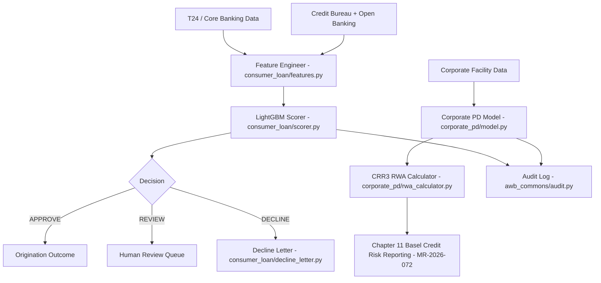
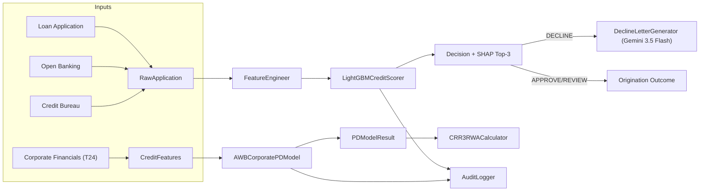
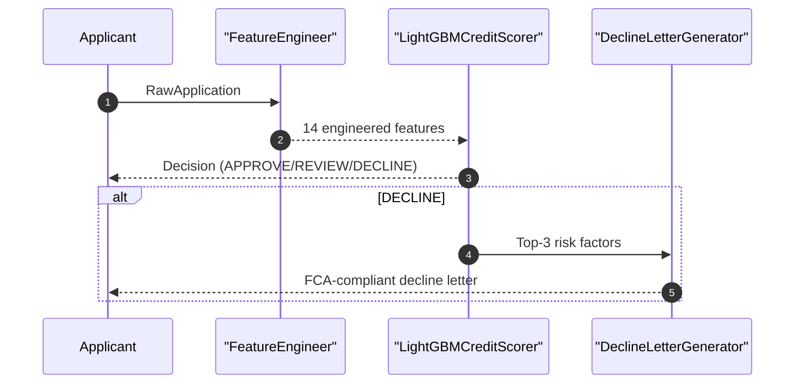

# AI Banking Risk Platform

[](https://opensource.org/licenses/MIT)
[](https://www.python.org/downloads/)
[](https://github.com/psf/black)

> **Production-ready AI/ML implementations for banking risk, compliance, 
> and regulatory reporting**

Companion code repository for the book **"AI for Financial Risk, Compliance 
and Regulatory Reporting: The Enterprise Implementation Guide"**

## 🎯 What's Included

- ✅ **16 Complete Chapters** - From foundations to production deployment
- ✅ **50+ Production Systems** - Real, deployable implementations
- ✅ **40,000+ Lines of Code** - Tested Python code
- ✅ **5 Risk Domains** - Credit, Market, Operational, Liquidity, Model Risk
- ✅ **Compliance & Regulatory** - AML/KYC, Basel III, GDPR
- ✅ **Enterprise Architecture** - Microservices, MLOps, Data Infrastructure

## Chapter 6 - Credit Risk Intelligence with AI

**AI for Financial Risk, Compliance and Regulatory Reporting**
*Avon & Wessex Bank plc (AWB) - AWB-AI-2025 Programme*

---

### Overview

This codebase implements the Chapter 6 credit risk intelligence stack across:
corporate PD modeling (MR-2026-043), consumer loan origination (MR-2026-041), and
the Credit Underwriting Assistant credit memo pipeline (MR-2026-068). COREP C
02.00/C 08.00 reporting for these credit models is built in Chapter 11's Basel
Credit Risk Reporting module (MR-2026-072, Section 11.3).

| Model ID | System | SS1/23 Risk | EU AI Act |
|----------|--------|-------------|-----------|
| MR-2026-043 | AWB Corporate PD Model (XGBoost + SHAP) | HIGH | HIGH-RISK Annex III 5(b) |
| MR-2026-041 | Consumer Loan Origination (LightGBM) | MEDIUM | HIGH-RISK Annex III 5(b) |
| MR-2026-055-AGT | Credit Intelligence Monitor — Agentic (Section 6.3A) | HIGH | HIGH-RISK Annex III 5(b) |
| MR-2026-068 | Credit Underwriting Assistant (Section 6.8B) | HIGH | HIGH-RISK Annex III 5(b) |

**Monthly running cost:** GBP 27 (GBP 2 LLM + GBP 25 infrastructure)  
Full CIM platform ROI (GBP 0.99M annual saving, <2 month payback) is derived in
the book's Section 6.7.4 for the five-module CIM (MR-2026-055), not this file.

---

### Architecture (Mermaid)



---

### Data Flow (Mermaid)



---

### Sequence Diagram (Mermaid)



---

### Regulatory Compliance

| Obligation | Implementation |
|------------|----------------|
| CRR3 Art. 153 | `corporate_pd/rwa_calculator.py` IRB RWA formula |
| CRR3 Art. 160 | PD floor 0.03% in `corporate_pd/model.py` and `rwa_calculator.py` |
| CRR3 Art. 174 | 7-year training window (2018-2024) in `corporate_pd/model.py` |
| CRR3 Art. 176 | Full validation suite in `corporate_pd/validator.py` |
| CRR3 Art. 180 | Long-run PD deviation checks in `validator.py` |
| FCA PS22/9 | Fairness monitor and decline letter rules in `consumer_loan/fairness.py` and `consumer_loan/decline_letter.py` |
| FCA COBS 9 | 7-year audit retention in `awb_commons/audit.py` |
| Consumer Credit Act 1974 | CRA disclosure in decline letters (`decline_letter.py`) |
| PRA SS1/23 | Model risk ratings + audit evidence across all models |
| EU AI Act Annex III 5(b) | Credit Underwriting Assistant explainable threshold assessment in `underwriting/credit_memo_generator.py` |
| EU AI Act Annex III 5(b) | Consumer and corporate creditworthiness use cases |
| DORA | ICT assets: CLO-2026-001, PD-2026-043 |

---

### Agentic AI Pipeline — Section 6.3A

`agentic_cim.py` implements the **Credit Intelligence Monitor (CIM)** — a LangGraph StateGraph
with five specialist agents (MR-2026-055-AGT):

```
START → DataIngestion → CreditAnalysis → RegulatoryCheck → RiskSynthesis → DecisionAgent → HITL → END
```

- **Agent 1–3** (Gemini 3.5 Flash): data ingestion, PD/LGD/EAD computation, CRR3 RWA calculation
- **Agent 4** (Gemini 3.1 Pro): multi-factor risk synthesis, IFRS 9 staging
- **Agent 5 + HITL** (Claude Sonnet 4.6): regulatory narrative, mandatory human gate for exposures > £500K

```bash
python -c "
import asyncio
from agentic_cim import run_credit_intelligence_monitor
asyncio.run(run_credit_intelligence_monitor())
"
```

---

### Quick Start

```bash
# 1. Install dependencies
pip install -r requirements.txt

# 2. Set Google AI Studio API key (for decline letters + EWS news scan)
export GOOGLE_API_KEY="your_key_here"

# 3. Run tests (no API key required for unit tests)
pytest tests/ -v

# 4. Run all tests including live API
GOOGLE_API_KEY=your_key pytest tests/ -v

# 5. Interactive demo: consumer loan decline pipeline
python -c "
from consumer_loan.features import FeatureEngineer, RawApplication
from consumer_loan.scorer import LightGBMCreditScorer
from consumer_loan.decline_letter import DeclineLetterGenerator

app = RawApplication(
    application_id='APP-001',
    requested_amount_gbp=8000.0,
    loan_term_months=36,
    purpose='home_improvement',
    gross_annual_income=42000.0,
    employment_status='employed',
    employment_tenure_months=48,
    residential_status='owner',
    time_at_address_months=60,
    num_dependants=1,
    monthly_housing_cost=900.0,
    existing_monthly_commitments=250.0,
    bureau_score=520,
    bureau_adverse_flag=1,
    bureau_utilisation=0.55,
    ob_connected=False,
)

features = FeatureEngineer().engineer(app)
scorer = LightGBMCreditScorer.build_stub()
result = scorer.predict(app.application_id, features)
print(f'Decision: {result.decision} PD={result.pd_calibrated:.3f}')

if result.decision == 'DECLINE':
    letter = DeclineLetterGenerator().generate(app.application_id, result.shap_top3_risk)
    print(letter.letter_text[:200] + '...')
"
```

Get a free key at [Google AI Studio API key](https://aistudio.google.com/app/apikey).

---

### File Structure

```
chapter-06-credit-risk/
|-- awb_commons/
|   |-- schemas.py          # Shared contracts (CreditFeatures, PDModelResult)
|   |-- audit.py            # 7-year audit log (FCA COBS 9, PRA SS1/23)
|-- consumer_loan/
|   |-- features.py         # Feature engineering + Open Banking imputation
|   |-- scorer.py           # LightGBM scorer + Platt + SHAP (MR-2026-041)
|   |-- fairness.py         # FCA PS22/9 fairness monitor
|   |-- decline_letter.py   # Gemini 3.5 Flash decline letters
|-- corporate_pd/
|   |-- model.py            # XGBoost + Platt + SHAP (MR-2026-043)
|   |-- validator.py        # CRR3 Art. 176 validation suite
|   |-- rwa_calculator.py   # CRR3 Art. 153 IRB RWA + output floor
|-- underwriting/
|   |-- credit_memo_generator.py  # 3-stage credit memo pipeline (MR-2026-068)
|-- tests/
|   |-- test_consumer_loan.py
|   |-- test_corporate_pd.py
|   |-- test_credit_memo_generator.py
|-- requirements.txt
|-- README.md
```

COREP C 02.00/C 08.00 reporting for the corporate PD model's outputs is built in
`chapter-11-regulatory-compliance/basel_reporting/` (MR-2026-072, Section 11.3),
not in this chapter.

---

### Cost Derivation (GBP)

| Component | Monthly Cost |
|-----------|-------------|
| Gemini 3.5 Flash (consumer loan decline letters) | GBP 2 |
| AWS ECS (monthly fairness monitoring + PD validation) | GBP 8 |
| PostgreSQL audit log (7-year retention) | GBP 8 |
| S3 model artefacts | GBP 4 |
| Monitoring + logging | GBP 5 |
| **Total** | **GBP 27/month** |

Assumptions:
- 20,000 consumer loan applications per month with 35% declines (7,000 letters)
- 900 tokens per decline letter
- Analyst fully-loaded cost: GBP 55/hour (GBP 70k salary, 40% overhead, 1,750 hours)

Estimated monthly LLM cost calculation:
7,000 letters x 900 tokens / 1,000 x GBP 0.00025 = **GBP 1.60/month**

Note: the portfolio early-warning system (previously labelled MR-2026-042) and
its COREP C 07.00 generator have been removed from this chapter — MR-2026-042
was never a registered system in the book's Model Registry Index (Appendix),
and the book's current narrative (Section 6.8C) is explicit that CIM has no
single early-warning module; that signal is now split across the Adverse News
Monitor and PSI Monitor (both under MR-2026-055) and Chapter 12's AML
monitoring (MR-2026-060-AML). COREP reporting for the credit models here is
built in Chapter 11 (MR-2026-072). The full CIM platform ROI (GBP 0.99M annual
saving, <2 month payback) is derived independently in the book's Section 6.7.4
and is not recomputed in this file.

---

### LLM Selection Rationale

**Gemini 3.5 Flash** is used for consumer loan decline letters because:
- Lowest cost per token for high-volume, low-latency tasks
- Sufficient language quality for FCA PS22/9 consumer letters
- Clear separation from decision logic (LLM is advisory only)

*Models from approved June 2026 list only.
Never use: GPT-4, Claude 3.5 Sonnet, Gemini 3 (deprecated).*
