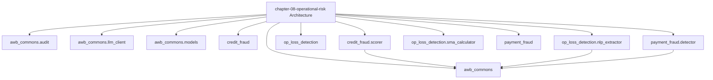

# AI Banking Risk Platform

[](https://opensource.org/licenses/MIT)
[](https://www.python.org/downloads/)
[](https://github.com/psf/black)

> **Production-ready AI/ML implementations for banking risk, compliance, 
> and regulatory reporting**

Companion code repository for the book **"AI for Financial Risk, Compliance 
and Regulatory Reporting: The Enterprise Implementation Guide"**

## 🎯 What's Included

- ✅ **16 Complete Chapters** - From foundations to production deployment
- ✅ **50+ Production Systems** - Real, deployable implementations
- ✅ **40,000+ Lines of Code** - Tested Python code
- ✅ **5 Risk Domains** - Credit, Market, Operational, Liquidity, Model Risk
- ✅ **Compliance & Regulatory** - AML/KYC, Basel III, GDPR
- ✅ **Enterprise Architecture** - Microservices, MLOps, Data Infrastructure

## Chapter 8: Operational Risk Detection and Management
### Avon & Wessex Bank plc (AWB) — AWB-AI-2025 Programme

**Book:** AI for Financial Risk, Compliance and Regulatory Reporting

---

### Overview

This package contains the production Python implementation for all
three operational risk AI systems built in Chapter 8.

| System | Model ID | SS1/23 Risk | EU AI Act | DORA Asset |
|--------|----------|-------------|-----------|------------|
| Payment Fraud Detector | MR-2026-049 | MEDIUM | HIGH-RISK §5b | PAY-2026-001 |
| Op Loss Event NLP | MR-2026-050 | LOW | Limited | OPL-2026-001 |
| Credit App Fraud Scorer | MR-2026-051 | MEDIUM | HIGH-RISK §5b | CAF-2026-001 |

**AWB 2024 op losses:** £18.4M | **2026 target:** <£10M (46% reduction)

---

### Quick Start

```bash
# Clone the repo
git clone https://github.com/lorvenio/ai-banking-risk-platform
cd ai-banking-risk-platform/chapter-08-operational-risk

# Install dependencies
pip install pytest pydantic xgboost numpy

# Run all tests (no live API calls required)
pytest tests/ -v

# Expected: 35 passed
```

---

### Package Structure

```
chapter-08-operational-risk/
├── awb_commons/
│   ├── models.py          # FraudAlert, OpLossEvent, FraudRiskScore
│   ├── audit.py           # 7-year PRA SS1/23 audit logger
│   └── llm_client.py      # MODEL_ID env var factory (Gemini/GPT/Claude)
├── payment_fraud/
│   └── detector.py        # XGBoost + rule overlay (MR-2026-049)
├── op_loss_detection/
│   ├── nlp_extractor.py   # Two-stage NLP pipeline (MR-2026-050)
│   └── sma_calculator.py  # CRR3 Art. 316-323 SMA capital
├── credit_fraud/
│   └── scorer.py          # Two-stage fraud scorer (MR-2026-051)
├── exercises/
│   ├── fraud_model.py     # Exercise 8.1 starter code
│   └── exercise_2.py      # Exercise 8.2 starter code
└── tests/
    └── test_chapter_08.py # 35 deterministic tests
```

---

### Exercises

#### Exercise 8.1 — Train the AWB Payment Fraud XGBoost Model
```bash
python exercises/fraud_model.py
```
**Difficulty:** ★★★☆☆ | **Time:** 45 minutes  
Implement `train_fraud_model()` to achieve recall > 0.90, FPR < 0.05.  
Solution: `chapter_08/solutions/fraud_model_solution.py`

#### Exercise 8.2 — Build the Full SMA Capital Impact Model
```bash
python exercises/exercise_2.py
```
**Difficulty:** ★★★★☆ | **Time:** 45 minutes  
Project AWB's ILM trajectory 2025-2030 using the SMACapitalCalculator.  
Solution: `chapter_08/solutions/exercise_2_solution.py`

---

### Key Design Decisions

**1. Cross-account velocity via Redis sliding windows**  
The cross-account velocity index (21.8% SHAP importance) is implemented
as a Redis sorted set keyed by device fingerprint hash. This is the
architectural innovation the rules-based system could not replicate.

**2. Two-stage NLP for SMA loss capture**  
Keyword pre-filter reduces 23,000 monthly documents to 1,200 candidates
before any LLM call, keeping monthly AI cost at £850.

**3. PII minimisation at feature engineering (UK GDPR Art. 25)**  
All model features are derived; raw PII never enters the model. Applicant
IDs are SHA-256 hashed (16-char truncated) in the audit log.

**4. ILM formula (CRR3 Art. 323)**  
`ILM = 1 + ln(1 + avg_annual_loss / (0.035 × BIC))`  
AWB pre-AI ILM ≈ 2.75, post-AI ≈ 2.41, capital saving ≈ £25.8M.

---

### Regulatory References

- PRA SS1/23: Model Risk Management (primary)
- CRR3 Articles 316-323: Basel III SMA capital
- EU AI Act Annex III §5b: HIGH-RISK classification
- DORA Art. 17: ICT incident classification
- FCA Consumer Duty PS22/9: false positive/decline rate controls
- UK GDPR Art. 25: Data protection by design

---

### Environment Variables

```bash
# LLM provider selection (default: Gemini 3.5 Flash)
export MODEL_ID="gemini-3.5-flash"
export GEMINI_API_KEY="your-key-here"

# Dry-run mode (no live API or DB calls)
export AGENT_DRY_RUN=true
```

---

*AWB is entirely fictional. June 2026.*  
*GitHub: github.com/lorvenio/ai-banking-risk-platform*

### Architecture Diagrams




