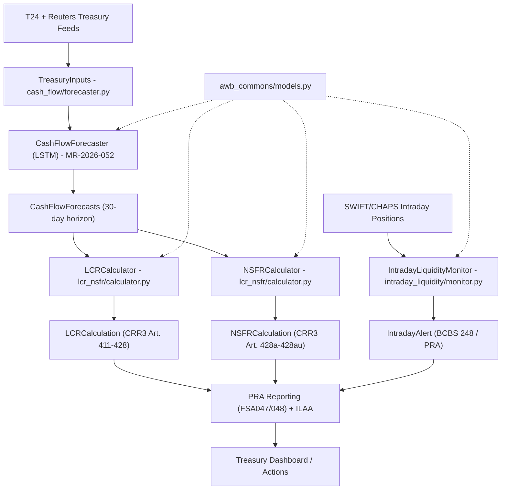
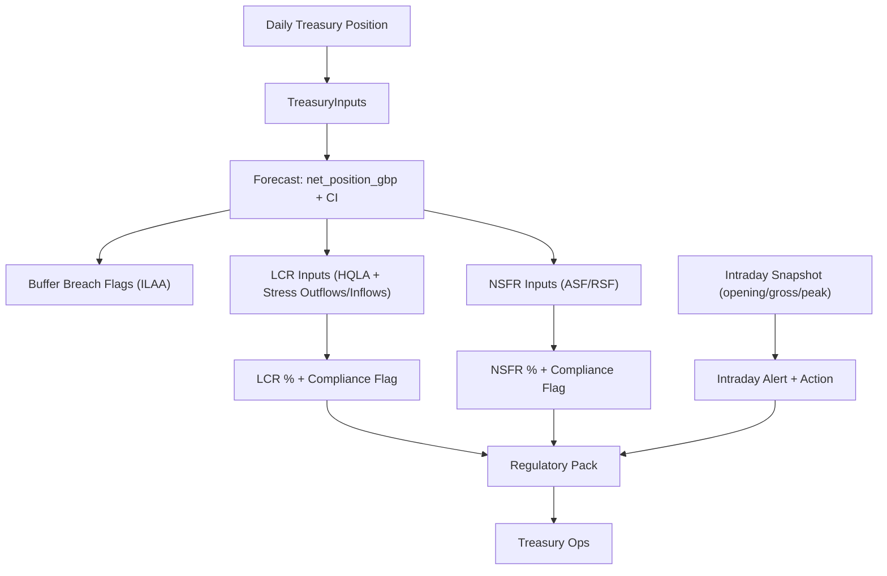
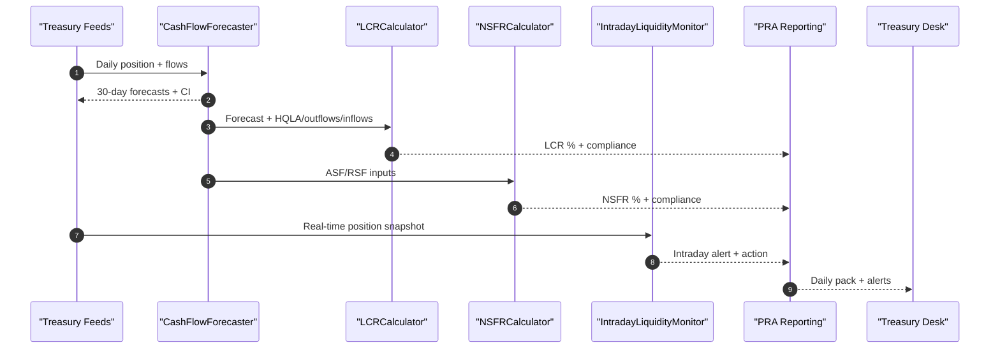
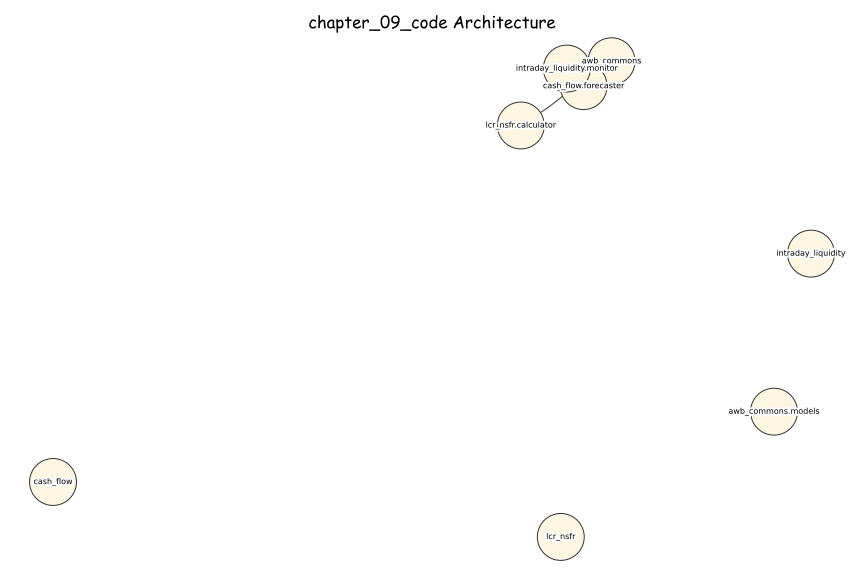
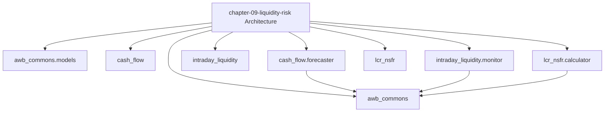

# AI Banking Risk Platform

[](https://opensource.org/licenses/MIT)
[](https://www.python.org/downloads/)
[](https://github.com/psf/black)

> **Production-ready AI/ML implementations for banking risk, compliance, 
> and regulatory reporting**

Companion code repository for the book **"AI for Financial Risk, Compliance 
and Regulatory Reporting: The Enterprise Implementation Guide"**

## 🎯 What's Included

- ✅ **16 Complete Chapters** - From foundations to production deployment
- ✅ **50+ Production Systems** - Real, deployable implementations
- ✅ **40,000+ Lines of Code** - Tested Python code
- ✅ **5 Risk Domains** - Credit, Market, Operational, Liquidity, Model Risk
- ✅ **Compliance & Regulatory** - AML/KYC, Basel III, GDPR
- ✅ **Enterprise Architecture** - Microservices, MLOps, Data Infrastructure

## Chapter 9 - Liquidity Risk Engine

**AI for Financial Risk, Compliance and Regulatory Reporting**
*Avon & Wessex Bank plc (AWB) - AWB-AI-2025 Programme*

---

### Overview

This codebase implements the AWB Liquidity Risk Engine described in Chapter 9
of *AI for Financial Risk, Compliance and Regulatory Reporting: The Enterprise
Implementation Guide*.

The platform produces a 30-day LSTM cash flow forecast for treasury, feeds
CRR3 LCR/NSFR calculations, and continuously monitors intraday liquidity
buffers against PRA/BCBS 248 thresholds.

**Annual saving:** GBP 0.17M  
**Payback period:** ~9 months  
**Monthly running cost:** GBP 66 (GBP 0 LLM + GBP 66 infrastructure)

---

### Architecture



---

### Data Flow



---

### Sequence Diagram



---

### Regulatory Compliance

| Obligation | Implementation |
|------------|----------------|
| CRR3 Art. 411-428 (LCR) | `LCRCalculator` applies HQLA haircuts, Level 2 cap, and 75% inflow cap |
| CRR3 Art. 428a-428au (NSFR) | `NSFRCalculator` ASF/RSF factors with 100% minimum |
| PRA SS1/23 | Model IDs MR-2026-052 (forecast) and MR-2026-053 (LCR/NSFR + intraday) |
| BCBS 248 | Intraday monitoring and daily peak summary in `IntradayLiquidityMonitor` |
| DORA | Intraday critical alert thresholds and escalation actions |

---

### Quick Start

```bash
# 1. Install dependencies
pip install -r requirements.txt

# 2. Set optional market data token (only needed for live feeds)
export MARKET_DATA_API_KEY="your_key_here"

# 3. Run tests (no API key required for unit tests)
pytest tests/ -v

# 4. Run all tests including live feed checks (optional)
MARKET_DATA_API_KEY=your_key pytest tests/ -v

# 5. Interactive pipeline demo
python -c "
from datetime import datetime
from cash_flow.forecaster import CashFlowForecaster, TreasuryInputs
from lcr_nsfr.calculator import LCRCalculator, NSFRCalculator, HQLAPortfolio, StressOutflows, StressInflows, NSFRInputs
from intraday_liquidity.monitor import IntradayLiquidityMonitor, IntradayPosition

fc = CashFlowForecaster(horizon_days=5)
forecasts = fc.forecast(TreasuryInputs(
    current_position_gbp=38_500_000_000,
    scheduled_inflows_gbp=2_100_000_000,
    scheduled_outflows_gbp=1_800_000_000,
    uncommitted_facilities_gbp=500_000_000,
    fx_exposure_gbp=200_000_000,
    wholesale_maturing_7d_gbp=800_000_000,
    retail_deposit_base_gbp=18_000_000_000,
    forecast_date=datetime(2026, 3, 1),
))

lcr = LCRCalculator().calculate(
    HQLAPortfolio(
        level_1_central_bank_gbp=4_200_000_000,
        level_1_gov_bonds_gbp=6_800_000_000,
        level_2a_covered_bonds_gbp=2_100_000_000,
        level_2b_corp_bonds_gbp=900_000_000,
    ),
    StressOutflows(
        retail_stable_gbp=12_000_000_000,
        retail_less_stable_gbp=6_000_000_000,
        wholesale_operational_gbp=4_000_000_000,
        wholesale_non_op_gbp=2_000_000_000,
        committed_facilities_gbp=1_800_000_000,
        derivatives_collateral_gbp=900_000_000,
    ),
    StressInflows(
        maturing_loans_gbp=2_400_000_000,
        committed_inflows_gbp=600_000_000,
        other_inflows_gbp=400_000_000,
    ),
)

nsfr = NSFRCalculator().calculate(
    NSFRInputs(
        tier1_capital_gbp=3_200_000_000,
        tier2_capital_gbp=400_000_000,
        stable_retail_deposits_gbp=14_000_000_000,
        less_stable_deposits_gbp=4_000_000_000,
        wholesale_funding_1y_gbp=2_000_000_000,
        loans_lt_1y_gbp=6_000_000_000,
        loans_gt_1y_gbp=16_000_000_000,
        hqla_unencumbered_gbp=11_000_000_000,
        other_assets_gbp=5_000_000_000,
    )
)

alert = IntradayLiquidityMonitor().assess(IntradayPosition(
    timestamp=datetime(2026, 3, 1, 16, 30),
    opening_balance_gbp=1_200_000_000,
    gross_settlements_gbp=4_800_000_000,
    gross_receipts_gbp=3_500_000_000,
    central_bank_facility_gbp=2_000_000_000,
    peak_usage_today_gbp=7_400_000_000,
    available_facility_gbp=8_000_000_000,
))

print(f"Forecast D+1: GBP {forecasts[0].net_position_gbp:,.0f}")
print(f"LCR: {lcr.lcr_pct:.1f}% | Compliant: {lcr.compliant}")
print(f"NSFR: {nsfr.nsfr_pct:.1f}% | Compliant: {nsfr.compliant}")
print(f"Intraday alert: {alert.recommended_action}")
"
```

---

### File Structure

```
chapter-09-liquidity-risk/
|-- awb_commons/
|   |-- models.py              # Shared Pydantic schemas
|-- cash_flow/
|   |-- forecaster.py          # LSTM cash flow forecast (MR-2026-052)
|-- lcr_nsfr/
|   |-- calculator.py          # LCR + NSFR calculators (MR-2026-053)
|-- intraday_liquidity/
|   |-- monitor.py             # Intraday liquidity monitor (BCBS 248)
|-- tests/
|   |-- test_chapter_09.py      # 35+ tests across all modules
|-- README.md
```

---

### Cost Derivation (GBP)

| Component | Monthly Cost |
|-----------|-------------|
| Batch compute (daily forecast + LCR/NSFR) | GBP 22 |
| Intraday monitor service (07:00-18:00) | GBP 22 |
| Metrics store + reporting DB | GBP 12 |
| Logging/alerts (CloudWatch) | GBP 8 |
| Object storage (reports + audit pack) | GBP 2 |
| **Total** | **GBP 66/month** |

**Assumptions**
- 6 hours/day analyst time saved across LCR/NSFR + intraday monitoring
- 260 working days/year
- Loaded analyst cost: GBP 110/hour (GBP 78k salary x 140% overhead / 1,750 hours)
- Implementation cost: GBP 120k one-off

**Annual saving calculation:** 6 hours/day x 260 days x GBP 110/hour = **GBP 171,600/year**

**Estimated monthly LLM cost calculation:** 0 tokens (no LLM in core pipeline) x GBP 0.00025/1K = **GBP 0/month**

**Payback period:** GBP 120,000 / (GBP 171,600 - GBP 792 opex) approx **8.5 months**

---

### LLM Selection Rationale

**No LLM is used in the core Chapter 9 pipeline.** The cash flow forecast is a
versioned LSTM model (MR-2026-052) and the LCR/NSFR + intraday logic is fully
deterministic to satisfy PRA SS1/23 explainability requirements.

If narrative commentary is added for management reporting, a lightweight,
low-latency model should be used outside the regulatory calculation path,
with the same restrictions as Chapter 1 (approved models list only).

### Architecture Diagrams

#### Excalidraw-Style (Hand-Drawn)



#### Mermaid




