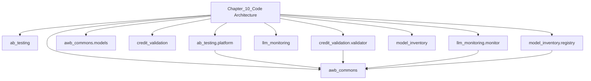

# Chapter 10 — Model Risk Management for AI/ML Systems

[](https://opensource.org/licenses/MIT)
[](https://www.python.org/downloads/)
[](https://github.com/psf/black)

> PRA SS1/23 model risk management — validation, monitoring, drift detection, and deployment gates for AWB's 23 production AI systems.

*Companion code for **"AI for Financial Risk, Compliance and Regulatory Reporting"** | AWB-AI-2025 Programme*

---

## Chapter 10 — Model Risk Management for AI/ML Systems

**Book:** AI for Financial Risk, Compliance and Regulatory Reporting  
**Author:** Sree Kotha  
**Programme:** AWB-AI-2025 | Avon & Wessex Bank plc  
**Regulation:** PRA SS1/23 (primary) | EU AI Act | DORA  
**GitHub:** github.com/lorvenio/ai-banking-risk-platform

---

### What This Package Contains

| Module | Description | Lines |
|--------|-------------|-------|
| `model_inventory/registry.py` | Enterprise Model Registry (FastAPI + PostgreSQL) | ~340 |
| `ab_testing/platform.py` | Champion/challenger A/B testing platform | ~180 |
| `credit_validation/validator.py` | Gini, KS, AUC-ROC, PSI, calibration suite | ~210 |
| `llm_monitoring/monitor.py` | RAGAS monitoring + prompt version registry | ~290 |
| `awb_commons/models.py` | Shared Pydantic schemas | ~90 |
| `exercises/` | Two starter exercises (see below) | — |
| `solutions/` | Reference solutions | — |
| `tests/test_chapter_10.py` | 35 pytest tests — all passing | ~420 |

---

### Quick Start

```bash
# 1. Clone / extract
cd chapter_10

# 2. Create virtual environment
python3 -m venv .venv
source .venv/bin/activate          # Windows: .venv\Scripts\activate

# 3. Install dependencies
pip install -r requirements.txt

# 4. Run all tests
pytest tests/ -v
# Expected: 35 passed

# 5. Run solution tests
pytest solutions/test_solutions.py -v
# Expected: 13 passed
```

---

### AWB Model Registry — June 2026

| MR Reference | System | Chapter | SS1/23 Risk | EU AI Act |
|---|---|---|---|---|
| MR-2026-035 | AWB Credit Document Analyser | 2 | MEDIUM | HIGH-RISK |
| MR-2026-036 | SME Financial Statement Analyser | 2 | MEDIUM | HIGH-RISK |
| MR-2026-037 | AWB Credit Decision Agent | 3 | HIGH | HIGH-RISK |
| MR-2026-038 | Regulatory Knowledge Assistant | 4 | LOW | Limited |
| MR-2026-039 | AI Governance Platform | 5 | LOW | Not in scope |
| MR-2026-040 | Payment Fraud Detector | 8 | MEDIUM | HIGH-RISK |
| MR-2026-041 | Op Loss Event NLP | 8 | LOW | Limited |
| MR-2026-042 | Credit App Fraud Scorer | 8 | MEDIUM | HIGH-RISK |
| MR-2026-043 | Cash Flow Forecaster | 9 | MEDIUM | Limited |

---

### Exercises

#### Exercise 10.1 — Credit Model Validation
**File:** `exercises/ex_10_1_validate.py`  
**Difficulty:** ★★★☆☆ | ~35 minutes

Implement `CreditModelValidator` with four PRA SS1/23 metrics:
- AUC-ROC (≥ 0.750)
- Gini coefficient (≥ 0.700)
- KS statistic (≥ 0.300)
- Population Stability Index (< 0.100)

```bash
pytest exercises/ex_10_1_validate.py -v
```

#### Exercise 10.2 — Model Registry and Deployment Gate
**File:** `exercises/ex_10_2_registry.py`  
**Difficulty:** ★★☆☆☆ | ~25 minutes

Implement `ModelRegistry` with registration, validation
recording, and deployment gate — enforcing PRA SS1/23
governance as a technical constraint.

```bash
pytest exercises/ex_10_2_registry.py -v
```

**Solutions:** `solutions/sol_10_1_validate.py` and
`solutions/sol_10_2_registry.py` — attempt the exercises
before looking.

---

### Key Architecture Decisions

1. **Deployment gate is the primary MRM control** — unregistered
   models cannot reach production regardless of developer intent.

2. **Prompt versioning via SHA-256 hash** — prompt changes to
   regulated LLMs are treated as model changes under SS1/23 §5.8.

3. **PSI as primary monitoring trigger** — distributional drift
   precedes observable performance degradation by 1–3 months.

4. **Event-triggered revalidation with 12-month backstop** —
   automated PSI/RAGAS monitoring triggers ad-hoc revalidation;
   annual review catches any gaps.

5. **5% RAGAS sampling** — balances statistical precision (±1.5%)
   with cost (£48/month at Gemini 3.5 Flash rates).

---

### Regulatory References

- **PRA SS1/23** (May 2023) — primary UK model risk standard
- **EU AI Act** Art. 9 (ongoing risk management), Art. 14
  (human oversight)
- **DORA** Art. 17 (ICT incident classification for agent failures)
- **UK GDPR** — PSI uses histogram not raw training records
  (data minimisation, Article 5(1)(c))

---

### Code Standards

- Python 3.11+ with type hints throughout
- Pydantic BaseModel for all data structures
- Google-style docstrings on all public methods
- Kindle hard limit: 60 characters per line in book snippets
- All tests use deterministic inputs (no live API calls required)

---

*AWB-AI-2025 Programme | Chapter 10 of 16*  
*github.com/lorvenio/ai-banking-risk-platform/chapter_10*

### Architecture Diagrams




