# AI Banking Risk Platform

[](https://opensource.org/licenses/MIT)
[](https://www.python.org/downloads/)
[](https://github.com/psf/black)

> **Production-ready AI/ML implementations for banking risk, compliance, 
> and regulatory reporting**

Companion code repository for the book **"AI for Financial Risk, Compliance 
and Regulatory Reporting: The Enterprise Implementation Guide"**

## 🎯 What's Included

- ✅ **16 Complete Chapters** - From foundations to production deployment
- ✅ **50+ Production Systems** - Real, deployable implementations
- ✅ **40,000+ Lines of Code** - Tested Python code
- ✅ **5 Risk Domains** - Credit, Market, Operational, Liquidity, Model Risk
- ✅ **Compliance & Regulatory** - AML/KYC, Basel III, GDPR
- ✅ **Enterprise Architecture** - Microservices, MLOps, Data Infrastructure

## Chapter 11: Regulatory Compliance Automation
### AI for Financial Risk, Compliance and Regulatory Reporting
#### Avon & Wessex Bank plc (AWB) — Bristol, UK

### Model Registry
| Model ID | System | SS1/23 Risk |
|----------|--------|-------------|
| MR-2026-047 | HMRC Tax Reporting Engine | LOW |
| MR-2026-048 | Multi-Jurisdiction Regulatory Reporting Platform | HIGH |
| MR-2026-049 | Basel Credit Risk Reporting Module | MEDIUM |

### Quick Start
```bash
git clone https://github.com/lorvenio/ai-banking-risk-platform
cd chapter_11
python -m venv venv && source venv/bin/activate
pip install -r requirements.txt
pytest tests/ -v          # 62 tests — all should pass
```

### Environment Variables
```bash
GEMINI_API_KEY=your_key_here   # Required for LLM commentary
T24_API_URL=http://t24-mirror  # T24 data feed
```

### Structure
- hmrc_tax/     HMRC CGT + ISA + client letter generation (MR-2026-047)
- mjrrp/        All 4 Basel pillars + XBRL filing (MR-2026-048)
- stress_testing/ PRA CST + BoE CBES scenario loaders
- basel_reporting/ COREP C02.00 + C08.00 filing engine (MR-2026-049)
- tests/        62 pytest tests — no live API keys needed

### Key Regulations
- CRR3 Art. 429 — Leverage ratio (4 components)
- CRR3 Arts 411-428 — LCR
- CRR3 Arts 428a-428au — NSFR
- EBA XBRL Taxonomy 4.0 — Filing format
- PRA PS17/23 — Reporting data quality
- TCGA 1992 s104 — CGT Section 104 pooling

### Architecture Diagrams

```mermaid
flowchart TD
  T["chapter-11-regulatory-compliance Architecture"]
  M1["awb_commons"]
  T --> M1
  M2["awb_commons.models"]
  T --> M2
  M3["basel_reporting"]
  T --> M3
  M4["basel_reporting.corep_filing_engine"]
  T --> M4
  M5["hmrc_tax"]
  T --> M5
  M6["hmrc_tax.section104"]
  T --> M6
  M7["hmrc_tax.section104_calculator"]
  T --> M7
  M8["hmrc_tax.tax_letter"]
  T --> M8
  M9["hmrc_tax.tax_letter_generator"]
  T --> M9
  M10["mjrrp"]
  T --> M10
  M11["mjrrp.lcr_calculator"]
  T --> M11
  M12["mjrrp.leverage_calculator"]
  T --> M12
  M13["mjrrp.leverage_commentary"]
  T --> M13
  M14["mjrrp.nsfr_calculator"]
  T --> M14
  M15["mjrrp.xbrl_filer"]
  T --> M15
  M16["stress_testing"]
  T --> M16
  M17["stress_testing.pra_cst_loader"]
  T --> M17
  M4 --> M1
  M7 --> M1
  M9 --> M1
  M11 --> M1
  M12 --> M1
  M13 --> M1
  M14 --> M1
  M15 --> M1
```




