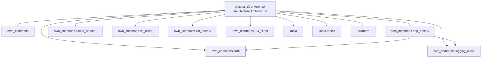

# AI Banking Risk Platform

[](https://opensource.org/licenses/MIT)
[](https://www.python.org/downloads/)
[](https://github.com/psf/black)

> **Production-ready AI/ML implementations for banking risk, compliance, 
> and regulatory reporting**

Companion code repository for the book **"AI for Financial Risk, Compliance 
and Regulatory Reporting: The Enterprise Implementation Guide"**

## 🎯 What's Included

- ✅ **16 Complete Chapters** - From foundations to production deployment
- ✅ **50+ Production Systems** - Real, deployable implementations
- ✅ **40,000+ Lines of Code** - Tested Python code
- ✅ **5 Risk Domains** - Credit, Market, Operational, Liquidity, Model Risk
- ✅ **Compliance & Regulatory** - AML/KYC, Basel III, GDPR
- ✅ **Enterprise Architecture** - Microservices, MLOps, Data Infrastructure

## Chapter 13 — Enterprise AI Architecture for Risk and Compliance
### AWB-AI-2025 Programme | awb_commons v2.3.1

This package contains the complete code deliverables for Chapter 13
of *AI for Financial Risk, Compliance and Regulatory Reporting*.

---

### What is in this package

| Directory | Contents |
|-----------|----------|
| `awb_commons/` | Shared library v2.3.1 — mandatory for all AWB AI services |
| `kafka/` | 8-topic MSK topology configuration |
| `terraform/` | ECS Task Definition Terraform module |
| `exercises/` | Starter code for exercises 13.1 and 13.2 |
| `solutions/` | Reference solutions (attempt exercises first!) |
| `tests/` | pytest test suite (all tests must pass) |

---

### Quick start

```bash
# Clone the repo
git clone https://github.com/lorvenio/ai-banking-risk-platform
cd ai-banking-risk-platform/chapter_013

# Create virtual environment
python -m venv .venv
source .venv/bin/activate   # Windows: .venv\Scripts\activate

# Install dependencies
pip install fastapi uvicorn pydantic psycopg2-binary pytest \
    httpx python-jose

# Run tests (no live API keys required)
pytest tests/ -v

# Run the exercise service locally
uvicorn exercises.service_scaffold:app --reload
```

---

### awb_commons — module reference

| Module | Key export | Purpose |
|--------|-----------|---------|
| `app_factory.py` | `create_app()` | FastAPI factory with JWT, CORS, rate limiting |
| `auth.py` | `verify_jwt_rs256()` | RS256 JWT verification against Cognito public key |
| `circuit_breaker.py` | `CircuitBreaker` | DORA Art.17 resilience — prevents cascade failures |
| `db_client.py` | `AWBDatabaseClient` | Aurora Serverless v2 pooled connections |
| `llm_factory.py` | `AWBLLMFactory` | DORA Art.28 multi-provider LLM client with failover |
| `logging_client.py` | `get_structured_logger()` | CloudWatch-indexed JSON logging |
| `t24_client.py` | `T24WriteClient` | Idempotent T24 write + compensating transaction |

---

### Environment variables

| Variable | Required | Description |
|----------|----------|-------------|
| `JWT_PUBLIC_KEY` | Yes | RS256 public key from AWS Cognito |
| `DATABASE_URL` | Yes | Aurora PostgreSQL DSN (from Secrets Manager) |
| `GOOGLE_API_KEY` | For Gemini | Google AI Studio API key |
| `OPENAI_API_KEY` | For GPT-5.5 | OpenAI API key |
| `ANTHROPIC_API_KEY` | For Claude | Anthropic API key |
| `AGENT_DRY_RUN` | No | Set `true` to run without live API calls |

---

### Regulatory context

- **PRA SS1/23**: All models are registered in the AWB model registry
  before deployment. awb_commons audit logger provides the 7-year
  retention trail required by FCA COBS 9.
- **DORA Art.17**: CircuitBreaker prevents ICT incident cascade failures.
- **DORA Art.28**: AWBLLMFactory enforces <70% concentration per provider
  (Gemini 68% | Claude 17% | GPT-5.5 15%).
- **DORA Art.9**: ECS Task Definitions require manual approval for
  production deployments (GitHub Actions environment protection).
- **UK GDPR**: All ECS tasks deployed in `eu-west-2` (London).
  No data processed outside the UK/EU.

---

### AWB-AI-2025 programme context

This code supports **Chapter 13** of the book's AWB case study.
Avon & Wessex Bank plc (AWB) is an entirely fictional institution.
All regulatory references are practitioner descriptions only —
seek qualified legal and regulatory counsel for your institution.

*AI for Financial Risk, Compliance and Regulatory Reporting*
*The Enterprise Implementation Guide — June 2026*

### Architecture Diagrams




