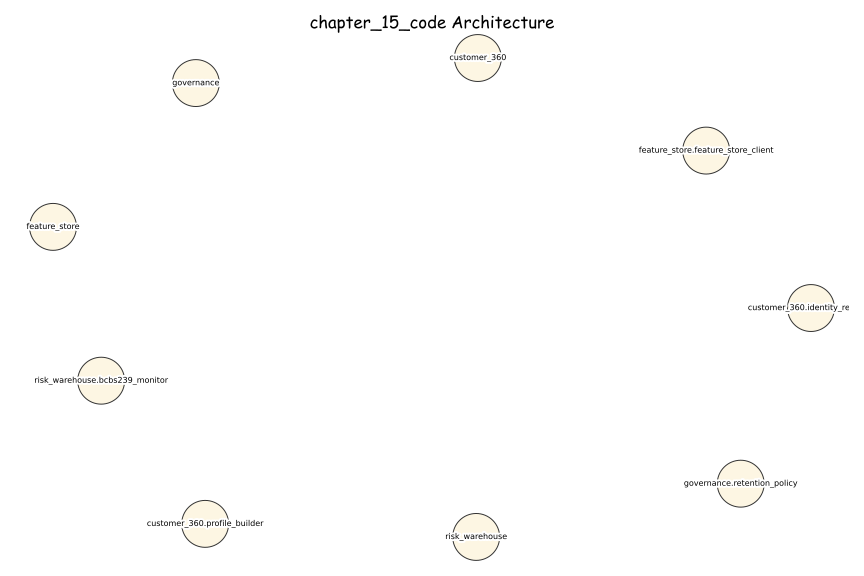
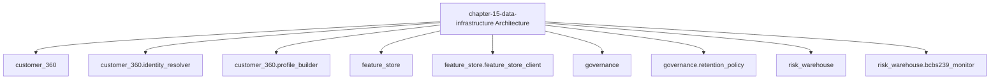

# Chapter 15 — Data Infrastructure for Risk and Regulatory Analytics

[](https://opensource.org/licenses/MIT)
[](https://www.python.org/downloads/)
[](https://github.com/psf/black)

> BCBS 239-compliant data infrastructure — Customer 360, enterprise risk warehouse, S3 data lake, point-in-time feature store, and UK GDPR retention governance.

*Companion code for **"AI for Financial Risk, Compliance and Regulatory Reporting"** | AWB-AI-2025 Programme*

---

## Section 15.3A — Agentic AI Pipeline: Data Quality Oversight

`agentic_data_infrastructure.py` implements a five-agent LangGraph StateGraph
that continuously monitors AWB's data estate for quality, lineage integrity,
and BCBS 239 compliance.

| Agent | LLM | Responsibility |
|---|---|---|
| DataQualityAgent | Gemini 3.5 Flash | Great Expectations suite — null rates, type checks, range violations |
| DataLineageAgent | Gemini 3.5 Flash | DVC lineage trace — training data provenance per SS1/23 §4.7 |
| BCBS239ComplianceAgent | Gemini 3.5 Flash | P1–P11 principle scoring (threshold ≥ 9.0/10) |
| FeatureStoreAgent | Gemini 3.1 Pro | PIT correctness audit — detect leakage windows |
| DataSummaryAgent | Claude Sonnet 4.6 | Executive data quality report + HITL decision |

**HITL gate triggers:** BCBS 239 score < 9.0, null rate > 2% on critical fields,
or lineage gap in regulated feature → HITLDecision.ESCALATE.

**ICT Asset IDs:** C360-2026-001, ERDW-2026-001, DL-2026-001, FTS-2026-001, GOV-2026-001

---

## Chapter 15: Data Infrastructure for Risk and Regulatory Analytics

**AWB-AI-2025 | Avon & Wessex Bank plc | Bristol, UK**

### Systems Built

| System | ICT Asset ID | Lines | Status |
|--------|-------------|-------|--------|
| Customer 360 Platform | C360-2026-001 | ~700 | ✅ |
| Enterprise Risk Data Warehouse | ERDW-2026-001 | ~1,200 | ✅ |
| Credit Data Lake (S3 three-zone) | DL-2026-001 | ~900 | ✅ |
| Feature Store (PIT PostgreSQL + Redis) | FTS-2026-001 | ~600 | ✅ |
| Data Governance (ROPA, BCBS 239) | GOV-2026-001 | ~500 | ✅ |

### Quick Start

```bash
git clone https://github.com/lorvenio/ai-banking-risk-platform
cd chapter_15
python -m venv .venv && source .venv/bin/activate
pip install -r requirements.txt
pytest tests/ -v -k "not live"
```

### Key Standards

- **BCBS 239**: P1–P11 compliance (9.2/10 — Q1 2026)
- **UK GDPR / DPA 2018**: Art.5 minimisation, Art.25 PbD
- **FCA COBS 9**: 7-year credit decision retention
- **MLR 2017 Reg 40**: 5-year SAR record retention
- **POCA 2002 s.333A**: SAR history — MLRO access only
- **PRA SS1/23**: Model training data provenance (DVC)
- **DORA**: ICT asset classification, 7-year audit log

### AWB Domain Baseline

| Metric | Value |
|--------|-------|
| Customer 360 profiles | 2.4M unified |
| Pre-C360 linkage errors | 8% (192,000 records) |
| BCBS 239 score | 9.2/10 (Q1 2026) |
| Feature Store latency | < 5ms (Redis) |
| Churn AUC improvement | 0.81 → 0.842 |

### Regulatory Disclaimer

Avon & Wessex Bank plc is entirely fictional.
Nothing here constitutes legal or regulatory advice.

### Architecture Diagrams

#### Excalidraw-Style (Hand-Drawn)



#### Mermaid




